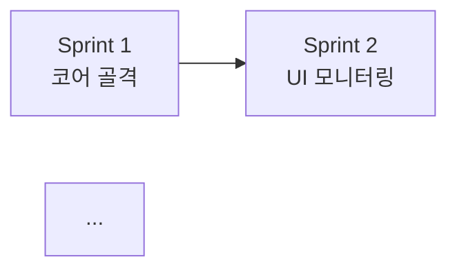

# /wbs

## 목적
SRS·PRD·아키텍처가 합의된 후, 작업 정본을 **스프린트(Milestone) → 이슈(Issue) 2계층**으로 분해한다(D-04). 본 산출이 `scripts/sprint-bootstrap.sh`의 입력이 되어 GitHub 작업 정본을 만든다(이 시점 이후 mode=sprint). **`14-wbs.md`는 살아있는 문서**로 운영되며, 매 스프린트 회고에서 갱신된다(policies/sprint-cycle.md §4).

> **Schema 강제 (ADR-0010 + 0015)**: `doc_type=wbs`. 신규 작성 시 `scaffold-doc.sh wbs docs/planning/14-wbs/14-wbs.md` → 작성 → `validate-doc.sh`. Sprint NN subsection·이슈 8필드(유형/영역/우선순위/Effort/Acceptance/Contract Before·After/DoD)·sprint-bootstrap YAML(`sprints:`+`project:`) BLOCK. schema: `.claude/schemas/wbs.schema.yaml`.

> 본 Command는 `/implementation-planner`(이슈 단위 커밋 plan)와 **계층이 다르다**. WBS는 *프로젝트 전체의 스프린트·이슈 목록*이며, planner는 *이슈 1개의 커밋·테스트 plan*이다.

## 호출 모드 (필수 인지)

본 Command는 두 가지 모드로 호출된다. 입력·완료 조건이 모드에 따라 다르다.

| 모드 | 호출 시점 | 입력 | 산출 |
|---|---|---|---|
| **신규 작성** (default) | 게이트 C 통과 직후 1회 | SRS·PRD·아키텍처·API·리스크 | `14-wbs.md` 신규 생성, 전 스프린트 일괄 분해 |
| **갱신** (rollover) | 매 스프린트 종료 후 (policies/sprint-cycle.md §4) | 직전 스프린트 회고(`docs/planning/retro/sprint-N.md`) + 기존 `14-wbs.md` | `14-wbs.md` §2 Sprint (N+1) 섹션 갱신, 추적성 매트릭스 누적 갱신 |

> 갱신 모드에서 **이전 스프린트 섹션은 보존**한다. "✅ closed (YYYY-MM-DD)" 표식만 추가하고 본문은 유지(추적성·후행 회고 입력으로 활용).

## 사용 시점
### 신규 작성 모드
- 게이트 C 통과 후 (`06-architecture.md`·`07-hld.md`·`10-lld-screen-design.md`·`09-lld-api-spec.md` 합의됨)
- `15-risk.md` 초안 작성 후 (리스크 인지 상태에서 분해)
- `/flow-new-project` 후반 — sprint-bootstrap 직전
- `14-wbs.md`가 미존재이거나 `> [DRAFT]` 상태

### 갱신 모드
- Sprint N의 모든 이슈가 close 또는 carryover 결정됨
- gstack `/retro` 산출이 `docs/planning/retro/sprint-N.md`로 저장됨
- 다음 Sprint (N+1) Milestone·Issues 등록 직전

## 입력

### 신규 작성 모드 (필수 7종)
| 입력 | 경로 | 사유 |
|---|---|---|
| 프로젝트 기획서 | `docs/planning/01-project-brief/01-project-brief.md` | 일정·KPI |
| SRS | `docs/planning/04-srs/04-srs.md` | R-ID 매핑(필수) |
| PRD | `docs/planning/05-prd/05-prd.md` | F-ID·MVP Cut |
| Architecture | `docs/planning/06-architecture/06-architecture.md` | 시스템·Stack·컨테이너 |
| HLD | `docs/planning/07-hld/07-hld.md` | 모듈 경계 (ADR-0031) |
| API 명세 | `docs/planning/09-lld-api-spec/09-lld-api-spec.md` | 인터페이스 단위 |
| 리스크 관리표 | `docs/planning/15-risk/15-risk.md` | 우선순위 보정 |
| docs/planning/INDEX.md | `docs/planning/INDEX.md` | D-04·D-05·D-06·5.2·5.3·5.7 |

### 갱신 모드 (필수 3종)
| 입력 | 경로 | 사유 |
|---|---|---|
| 직전 스프린트 회고 | `docs/planning/retro/sprint-N.md` | carryover·신규 이슈·우선순위 보정 |
| 기존 WBS | `docs/planning/14-wbs/14-wbs.md` | 누적 갱신 대상 |
| docs/planning/INDEX.md | `docs/planning/INDEX.md` | §5.7 사이클 정책 + §5.8 런타임 이슈 발견 분류 |
| (선택) GitHub 현재 상태 | `gh issue list --milestone "Sprint N" --state all` | 실제 close/carryover 검증 |
| (선택) 런타임 발견 이슈 | `gh issue list --label "carryover:from-sprint-N"` | Sprint N 도중 신설된 파생 이슈·carryover 수합 (policies/github-issue.md §5 / ADR-0008) |

입력 누락 시 `BLOCKED: 입력 부재 — <파일명>` 보고 후 회귀.

## 산출물
- `docs/planning/14-wbs/14-wbs.md`

## 문서 구조 (필수 섹션)

```markdown
# WBS / 스프린트 계획

> 문서 버전 / 작성일 / 작성자 / 상태

## 0. 개요
- 본 WBS의 작성 시점·전제 가정(아키텍처 기반)
- 스프린트 길이: 2주(D-04). 이슈 단위: 1~3 working days
- 권장 이슈 수: 스프린트당 5~15개(policies/github-issue.md §1)

## 1. 스프린트 일람
| Sprint | 기간 | 목표(Outcome) | 주요 R-ID/F-ID | 이슈 수 |
|---|---|---|---|---|
| Sprint 1 | M3 W1~W2 | 코어 에이전트 골격 | R-AGENT-01..03, F-AGENT-01 | 8 |
| ... |

## 2. 스프린트 상세

### Sprint N: <목표 한 줄>
- **기간**: M? W?~W?
- **Outcome**: 이 스프린트가 끝나면 데모 가능한 것
- **선행 스프린트**: Sprint (N-1) (없으면 "없음")

#### 이슈 목록

##### Issue: `<type>(<area>): <한 줄 summary>`  (ADR-0021 정규식 BLOCK)
- **제목 형식**: `<type>(<area>): <summary>` (단일) / `<type>(<area1>,<area2>): <summary>` (2개) / `<type>(multi): <summary>` (3개+, Touched Areas 강제). 정규식 `^(feat|fix|chore|docs|test|refactor)\([a-z][a-z0-9,_-]*\): .+$` (policies/github-issue.md §1.5)
- **유형**: feature / bug / chore / docs / test / refactor (policies/github-issue.md §2 + 제목 `<type>`과 정합)
- **영역**: frontend / backend / agent / infra / docs / multi (06 §3 모듈 인벤토리 도출, 제목 `<area>`와 정합)
- **우선순위**: P0 / P1 / P2 / P3
- **Estimated Effort** (필수, ADR-0008 §2.3): `0.5d` / `1d` / `2d` / `3d` 중 하나. 3d 초과 시 분할 강제
- **매핑**:
  - R-ID: R-AGENT-01, R-AGENT-02
  - F-ID: F-AGENT-01
  - UC: UC-01
- **Acceptance Criteria** (필수, ADR-0008 §2.3): 검증 가능한 Given/When/Then 1개 이상
  - Given <전제>, When <행동>, Then <기대 결과>
  - (1개 이상 필수 — 0개면 BLOCKED)
- **Contract Before / After** (필수, ADR-0008 §2.3):
  - 변경 전: <현재 동작 1줄 이상>
  - 변경 후: <변경 후 동작 1줄 이상>
- **DoD Checklist** (필수, ADR-0008 §2.3 + D-06):
  - [ ] 단위 테스트 작성
  - [ ] AI 게이트 통과 (D-06 1단)
  - [ ] PR 본문 Test Plan 4블록 첨부
  - [ ] (사람) tested 라벨 + Approve (D-06 2단)
- **테스트 시나리오 (인용/생성)** — D-06 1단 상류. [`scenario-derive`](../skills/devtoolkit/scenario-derive/SKILL.md) Skill이 자동 인용 (ADR-0022)
  - 상류 인용: SRS R-AGENT-01 §테스트 시나리오 / PRD F-AGENT-01 §테스트 시나리오
  - 상류 부재 시 fallback: <이슈 단위 시나리오 작성>
- **Blocked-by**: #(이슈 N), #(이슈 M) (없으면 "없음")
- **Blocks**: #(이슈 K) (없으면 "없음")
- **라벨 후보**: priority:P0, type:feature, area:agent

(이상을 모든 이슈에 반복. 이슈 템플릿 4필드(Acceptance Criteria / Contract Before·After / Estimated Effort / DoD Checklist) 누락 시 BLOCKED — ADR-0008 §2.3.)

## 3. 의존성 그래프 (DAG)
mermaid graph로 스프린트·핵심 이슈 의존성 표현


## 4. 추적성 매트릭스 (Traceability)
| R-ID | F-ID | Sprint | Issue Slug |
|---|---|---|---|
| R-AGENT-01 | F-AGENT-01 | S1 | agent-skeleton |

## 5. 리스크 매핑
| 15-risk Risk-ID | 영향 받는 Sprint/Issue | 대응 이슈 |
|---|---|---|
| RISK-01 | S2 / agent-cost-cap | #N |

## 6. 일정 (대략)
- Sprint 1: M3 W1~W2
- Sprint 2: M3 W3~W4
- ...
- 총 스프린트 수 / MVP 도달 시점

## 7. sprint-bootstrap 입력 형식 (자동 변환 대상)

> **ADR-0045 v1.1 강제**: `issues[].body:`는 §2 11필드를 마크다운으로 *그대로 직렬화*한 결과 + footer `> 📋 Source: [{{WBS_URL}}]({{WBS_URL}}) §2 Sprint N` placeholder 1줄. LLM 직접 작성 markdown link 형식 WBS 링크 금지(`docs/planning/.*wbs`·`13-wbs.md`·`github.com/...blob...wbs` forbidden_patterns BLOCK). `scripts/sprint-bootstrap.sh`가 등록 직전 시점에 `gh repo view`로 절대 URL 추출·치환. 상류 추적은 R-ID/F-ID로 + footer 링크로 §2 직접 도달.

```yaml
# scripts/sprint-bootstrap.sh가 읽는 YAML 블록 (필수). body는 GitHub 이슈 본문에 그대로 들어감.
sprints:
  - name: Sprint 1
    milestone: Sprint 1
    due: 2026-MM-DD
    issues:
      - title: "feat(agent): 코어 에이전트 골격"
        labels: [priority:P0, type:feature, area:agent]
        body: |
          ## 매핑
          - R-ID: R-AGENT-01, R-AGENT-02
          - F-ID: F-AGENT-01
          - UC: UC-01

          ## 유형 / 영역 / 우선순위
          - 유형: feature
          - 영역: agent
          - 우선순위: P0
          - Estimated Effort: 2d

          ## Acceptance Criteria
          - Given <전제>, When <행동>, Then <기대 결과>
          - (Given/When/Then 1개 이상)

          ## Contract
          - 변경 전: <현재 동작 1줄 이상>
          - 변경 후: <변경 후 동작 1줄 이상>

          ## DoD Checklist
          - [ ] 단위 테스트 작성
          - [ ] AI 게이트 통과 (D-06 1단)
          - [ ] PR 본문 Test Plan 4블록 첨부
          - [ ] (사람) tested 라벨 + Approve (D-06 2단)

          ## 테스트 시나리오
          - 상류 인용: SRS R-AGENT-01 §테스트 시나리오 / PRD F-AGENT-01 §테스트 시나리오
          - (상류 부재 시 fallback: <이슈 단위 시나리오>)

          ## 의존성
          - Blocked-by: 없음
          - Blocks: 없음

          > 📋 Source: [{{WBS_URL}}]({{WBS_URL}}) §2 Sprint 1

# Projects v2 (View 계층, ADR-0009 / docs/planning/policies/github-issue.md §2.1).
# 단방향 sync: Issues/Milestone → Project. 역방향 금지.
project:
  number: <Project v2 number>      # 본인/조직 owner의 Project 번호 (gh project list)
  fields:
    Status: status:* 라벨 → 단방향 sync
    Iteration: Milestone → 단방향 sync
    Effort: 본문 Estimated Effort → number
    Area: area:* 라벨 → single-select
    R-ID: 본문 매핑.R-ID → text
    F-ID: 본문 매핑.F-ID → text
```

> **body 직렬화 규칙 (ADR-0045 v1.1 §2.2)**:
> 1. §2 `##### Issue:` subsection 11필드(유형·영역·우선순위·Estimated Effort·매핑·Acceptance Criteria·Contract Before·Contract After·DoD Checklist·테스트 시나리오·Blocked-by·Blocks)를 위 13블록 마크다운으로 1:1 미러링
> 2. 누락 필드 0개 — §2 BLOCK과 동일 강도
> 3. footer 1줄 `> 📋 Source: [{{WBS_URL}}]({{WBS_URL}}) §2 Sprint N` 필수 — **`{{WBS_URL}}` placeholder 그대로** 작성. LLM이 절대 URL 직접 작성 금지(`docs/planning/.*wbs`·`13-wbs.md`·`github.com/...blob...wbs` markdown link 형식 forbidden_patterns BLOCK). `sprint-bootstrap.sh`가 등록 직전 시점에 `gh repo view`로 추출·치환
> 4. 상류 SRS R-ID·PRD F-ID·UC는 §"매핑" 블록에 명시 — newProject repo의 `docs/planning/04-srs/`·`05-prd/`에서 grep으로 역추적

## 8. Open questions
- ID로 관리, docs/planning/open-items.md 또는 ADR로 이관

## 변경 이력
| Version | Date | Author | Change |
```

## 실행 단계

### 신규 작성 모드
1. 입력 7개 모두 Read. 누락 시 BLOCKED.
2. PRD MVP Cut의 F-ID를 **출시 가능 단위**로 묶어 스프린트 후보 도출.
3. 각 F-ID·R-ID를 1~3 working days 이슈로 분해. 추정 초과 시 더 잘게 쪼갬.
4. 각 이슈에 라벨 후보(우선순위·유형·영역·상태) + Blocked-by/Blocks 명시.
5. 각 이슈에 **이슈 템플릿 4필드 강제** (ADR-0008 §2.3): Acceptance Criteria(Given/When/Then 1개 이상), Contract Before·After(각 1줄 이상), Estimated Effort(0.5d/1d/2d/3d), DoD Checklist(D-06 2단 항목 박아둠 — 단위 테스트·AI 게이트·Test Plan 4블록·tested 라벨·Approve). 누락 시 BLOCKED.
6. 각 이슈 테스트 시나리오에 SRS/PRD 상류 인용 시도. 상류 부재 시 fallback 명시.
7. 의존성 DAG 그리기 → 순환 검사. 순환 발견 시 BLOCKED.
8. 추적성 매트릭스가 SRS R-ID 100%·PRD F-ID 100% 커버하는지 검증.
9. 리스크 매핑 표 작성(15-risk.md ↔ Sprint/Issue).
10. 일정 추정 → 기획서 §6 일정과 충돌 시 재조정 또는 ADR.
11. **§7 sprint-bootstrap 입력 YAML 블록 작성(필수, ADR-0045 v1.1)**. 각 이슈의 `body:`에 §2 11필드를 §7 직렬화 템플릿 13블록으로 미러링 + footer `> 📋 Source: [{{WBS_URL}}]({{WBS_URL}}) §2 Sprint N` placeholder 1줄. LLM 직접 작성 markdown link 형식 WBS 링크 금지 — sprint-bootstrap.sh가 등록 직전 시점에 절대 URL로 치환. 상류 추적은 R-ID/F-ID + footer 링크.
12. 저장. docs/planning/CHANGELOG.md §"Current Status" 갱신은 `/docs-update`가 담당.

### 갱신 모드 (Sprint Rollover, policies/sprint-cycle.md §4)
1. 입력 3종(retro·기존 wbs·docs/planning/INDEX.md) Read. 가능하면 GitHub 현재 상태도 sync. 누락 시 BLOCKED.
2. **이전 스프린트 섹션 보존 처리**: §2 Sprint N 섹션의 헤더에 `✅ closed (YYYY-MM-DD)` 표식만 추가. 이슈 목록·DoD·매핑 본문은 손대지 않음.
3. retro 산출에서 다음 항목 추출:
   - **Carryover 이슈**: Sprint N에서 미완 상태로 다음으로 넘기는 이슈. 라벨 `carryover:from-sprint-N` 부여 표식.
   - **신규 이슈**: 회고에서 새로 발견된 작업.
   - **우선순위·일정 보정**: P-레벨 변경, 추정 보정.
4. **런타임 발견 이슈 분류 (policies/github-issue.md §5 / ADR-0008)**: Sprint N 도중 작업 중 발견되어 새로 등록된 이슈를 3가지 패턴으로 정리:
   - **A. Derived (파생)**: 독립 이슈. 다음 스프린트(N+1)로 carryover, P-레벨 결정
   - **B. Blocker**: `Blocked-by` 사슬 검증, 다음 스프린트 우선순위
   - **C. Bug**: `type:bug`로 별도 분류, 영역(area) 라벨 따라 배치
5. §2 Sprint (N+1) 섹션 갱신:
   - Carryover 이슈 먼저 배치 (이슈 템플릿 4필드는 기존 본문 복사)
   - 4번에서 분류한 런타임 발견 이슈 추가 (모두 독립 이슈로 평면 배치)
   - 신규 이슈 추가 (P0 → P3 순). **이슈 템플릿 4필드 필수 강제** (ADR-0008 §2.3 — Acceptance / Contract / Effort / DoD)
   - 추정 합계가 5~15 이슈, 스프린트 capacity 초과 시 P3부터 Sprint (N+2)로 이월
6. 추적성 매트릭스에 신규 이슈의 R-ID/F-ID 매핑 행 추가. 이전 행 보존. 모든 이슈는 자체 R-ID/F-ID로 독립 매핑.
7. 리스크 매핑 표 누적 갱신.
8. §7 sprint-bootstrap 입력 YAML 블록을 **`--sprint=N+1` 모드에 맞게** 부분 작성 (Sprint N+1 항목만). **carryover 이슈도 §2 본문을 §7 `body:`로 동일 직렬화 강제(ADR-0045 v1.1)** — 13블록 마크다운 + footer `{{WBS_URL}}` placeholder 1줄 포함. 기존 issue body는 등록 시점 스냅샷이므로 신 sprint 등록 시점 §2와 정합 보장.
9. **변경 이력 표에 1행 누적**: `Sprint N 회고 후 Sprint (N+1) 갱신 — carryover X건, 신규 Y건 (그중 파생 Z건)`
10. 저장. docs/planning/CHANGELOG.md §"Current Status" 갱신은 `/docs-update`. 이후 `scripts/sprint-bootstrap.sh --sprint=N+1` 실행은 사용자가 수행(자동화 아님).

## 완료 조건

### 신규 작성 모드
- 모든 SRS R-ID와 PRD F-ID가 적어도 1개 이슈에 매핑
- 각 이슈 추정 시간이 1~3 working days 이내
- 스프린트당 이슈 수 5~15
- 모든 이슈 DoD에 D-06 2단 항목 박혀 있음
- DAG 순환 없음
- **모든 이슈의 §7 `body:`가 §2 11필드를 완전 미러링 + footer placeholder 1줄 포함 (ADR-0045 v1.1)** — 13블록 마크다운 + `> 📋 Source: [{{WBS_URL}}]({{WBS_URL}}) §2 Sprint N` 누락 0건
- **이슈 본문에 LLM 직접 작성 WBS.md 링크 0건 (ADR-0045 v1.1)** — markdown link 형식 forbidden_patterns 적중 0. `{{WBS_URL}}` placeholder만 허용
- 팀장 컨펌(conventions/deliverables.md §4 산출 기준)

### 갱신 모드
- Sprint N 섹션에 `✅ closed` 표식 + 본문 보존
- Sprint (N+1) 섹션에 carryover + 신규 이슈 + 런타임 발견 파생 이슈 모두 반영 (모두 평면 독립 이슈)
- 모든 carryover 이슈에 라벨 표식(`carryover:from-sprint-N`) 명시
- 신규/파생 이슈 모두 이슈 템플릿 4필드(Acceptance / Contract / Effort / DoD) 충족 (ADR-0008 §2.3)
- 추적성 매트릭스·리스크 매핑이 모든 신규 이슈까지 커버 (각 이슈가 자체 R-ID/F-ID)
- 변경 이력 표 1행 추가

## Strict Rules
- **이슈 추정이 3 working days 초과 → 분할 강제** (policies/github-issue.md §1)
- **DoD에 D-06 게이트 누락 → BLOCKED**
- **SRS R-ID 미매핑 → BLOCKED** (PRD에서 명시적 Out 처리한 경우 예외)
- 시크릿·내부망 URL 본문 삽입 금지
- 스프린트 번호 `Sprint N`은 sprint-bootstrap 후 GitHub Milestone 이름과 일치해야 함
- **§7 `body:`가 §2 11필드를 미러링하지 않으면 BLOCKED (ADR-0045)** — 13블록 마크다운(매핑·유형/영역/우선순위·Acceptance Criteria·Contract·DoD Checklist·테스트 시나리오·의존성) 누락 검출 시 차단. LLM이 자체 요약하지 말고 §2를 그대로 옮김
- **§7 body footer에 `{{WBS_URL}}` placeholder 1줄 필수 (ADR-0045 v1.1)** — `> 📋 Source: [{{WBS_URL}}]({{WBS_URL}}) §2 Sprint N`. `sprint-bootstrap.sh`가 등록 직전 시점에 `gh repo view`로 절대 URL 추출·치환
- **이슈 본문에 WBS.md 링크 직접 작성 금지 (ADR-0045 v1.1)** — markdown link 형식(`\]\(...docs/planning...wbs...\)`·`\]\(...13-wbs.md...\)`·`\]\(...github.com...blob...wbs...\)`) forbidden_patterns 적중 시 BLOCKED. `{{WBS_URL}}` placeholder만 허용 — placeholder는 토큰 매칭에서 자연 통과

## BLOCKED 케이스
| 메시지 | 원인 | 조치 | 모드 |
|---|---|---|---|
| `BLOCKED: 입력 부재 — 06-architecture.md` | 게이트 C 미통과 | `/implementation-planner` 또는 게이트 C 회귀 | 신규 |
| `BLOCKED: R-ID 미매핑 — R-XX` | 누락된 요구사항 | 이슈 신설 또는 PRD에서 Out 처리 후 재진입 | 신규 |
| `BLOCKED: 추정 초과 — Issue X (>3d)` | 이슈 비대 | 더 잘게 분해 | 전역 |
| `BLOCKED: DAG 순환 — A↔B` | 의존성 순환 | 분해 재구성 또는 ADR로 결정 | 전역 |
| `BLOCKED: DoD에 D-06 항목 누락` | 게이트 누락 | DoD 체크리스트에 D-06 1단·2단 추가 | 전역 |
| `BLOCKED: 이슈 템플릿 필드 누락 — Acceptance Criteria` | ADR-0008 §2.3 4필드 중 누락 | Given/When/Then 1개 이상 추가 | 전역 |
| `BLOCKED: 이슈 템플릿 필드 누락 — Contract Before/After` | ADR-0008 §2.3 4필드 중 누락 | "변경 전:" / "변경 후:" 각 1줄 이상 추가 | 전역 |
| `BLOCKED: 이슈 템플릿 필드 누락 — Estimated Effort` | ADR-0008 §2.3 4필드 중 누락 | `0.5d`/`1d`/`2d`/`3d` 중 명시 | 전역 |
| `BLOCKED: retro 부재 — sprint-N.md` | 회고 미수행 | 먼저 `/retro` 실행해 산출 저장 | 갱신 |
| `BLOCKED: §7 body 11필드 미러링 누락` | LLM이 §2 → §7 body 직렬화 시 필드 일부 누락 (ADR-0045) | §2 11필드 → §7 13블록 마크다운으로 그대로 복사. 자체 요약 금지 | 전역 |
| `BLOCKED: 이슈 본문에 WBS 링크 임베드 — ADR-0045 v1.1` | §7 body에 markdown link 형식 `\]\(...docs/planning...wbs...\)`·`\]\(...13-wbs.md...\)`·`\]\(...github.com...blob...wbs...\)` 패턴 포함 | 링크 제거 + footer `[{{WBS_URL}}]({{WBS_URL}})` placeholder로 교체. sprint-bootstrap.sh가 등록 직전 절대 URL 치환 | 전역 |
| `BLOCKED: Sprint N 이슈 미정리` | 미완 이슈 carryover/close 미결정 | 회고에서 결정 후 재진입 | 갱신 |
| `BLOCKED: 이전 스프린트 섹션 변경 감지` | 신규/갱신 모드 혼동으로 Sprint N 본문 수정 시도 | Sprint N 본문 복원, ✅ closed 표식만 추가 | 갱신 |

## Artifact Binding

### 신규 작성 모드
- 입력: `01-project-brief.md`, `04-srs.md`, `05-prd.md`, `06-architecture.md`, `07-hld.md`, `09-lld-api-spec.md`, `15-risk.md`, `docs/planning/INDEX.md`
- 출력: → `scripts/sprint-bootstrap.sh` (인자 없이 호출 = WBS 전체 1~N 일괄 등록). 이후 `mode=sprint`로 전환되어 `/flow-feature-add` 등이 이슈 단위로 동작
- 페어링: `/plan-eng-review`(검토, 선택), ADR 직접 작성(결정 발생 시)

### 갱신 모드 (policies/sprint-cycle.md §4)
- 입력: `docs/planning/retro/sprint-N.md`, 기존 `14-wbs.md`, `docs/planning/INDEX.md`, (선택) GitHub 이슈 상태
- 출력: → `scripts/sprint-bootstrap.sh --sprint=N+1` (Sprint N+1 Milestone + Issues만 추가 등록)
- 페어링:
  - 선행: gstack `/retro` (필수, 회고 산출 입력 제공)
  - 후행: 사용자가 `sprint-bootstrap.sh --sprint=N+1` 직접 실행 + 이전 Milestone N close (수동 또는 `gh issue close` 보조)

## 트리거 매칭
- 신규 작성: "WBS 작성", "스프린트 분해", "이슈 분해", "Milestone 계획", "14-wbs.md", "sprint-bootstrap 준비"
- 갱신: "스프린트 회고 후 WBS 갱신", "Sprint N→N+1 전환", "rollover", "carryover 정리", "다음 스프린트 계획"
