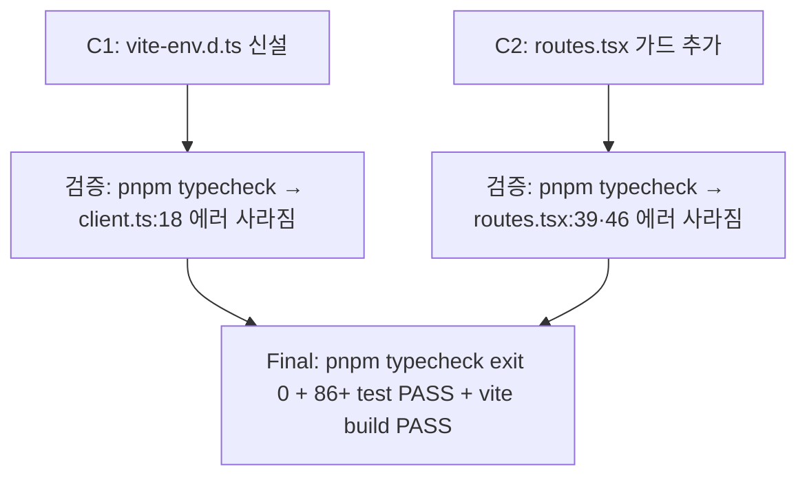

# bug-pre-existing-ts-errors-fix — Implementation Plan

## 변경 이력

| Version | Date | Author | Change |
|---|---|---|---|
| v0.1 | 2026-05-28 | jungsoobin96 | 초안 — 2 commit DAG (vite-env + routes 가드) (이슈 #48) |

## 1. 커밋 시퀀스 (DAG)

| # | 커밋 | 영향 파일 | 테스트 추가 | 회귀 위험 |
| --- | --- | --- | --- | --- |
| C1 | `fix(frontend): add vite-env.d.ts for ImportMetaEnv typing (#48)` | `frontend/src/vite-env.d.ts` (신설) | N/A (type-only ambient declaration, runtime 동작 변경 0건) | 낮음 — Vite 표준 패턴, runtime emit 0줄 |
| C2 | `fix(frontend): add non-null assertion to regex match groups in matchRoute (#48)` | `frontend/src/router/routes.tsx` (line 39, 46 수정) | N/A (기존 `frontend/tests/unit/router/routes.test.ts` 회귀 검증 충분 — runtime 동작 변경 0건) | 낮음 — `!` non-null assertion은 type-only operator, runtime 동작 동일 |

squash 머지 후 main에는 단일 commit 기록 — commit body에 `Closes #48` + R-ID 매핑 + breaking 노트(`Breaking: 없음`) + 부팅 자산 메모(`부팅 자산: 없음`) 포함.

## 2. 의존성 그래프



C1·C2는 **독립** (두 결함은 서로 다른 모듈 — client.ts vs routes.tsx). 순서 무관하나 plan 가독성을 위해 C1(vite-env 신설) → C2(routes 가드) 순으로 진행.

## 3. 테스트 매핑

| 커밋 | 테스트 추가 위치 | 시나리오 |
| --- | --- | --- |
| C1 | N/A (type-only, runtime 동작 변경 0건) | 기존 `frontend/tests/unit/api/client.test.ts` 회귀 검증 — vitest의 vite import.meta.env mock으로 자동 PASS |
| C2 | N/A (type-only, runtime 동작 변경 0건) | 기존 `frontend/tests/unit/router/routes.test.ts` matchRoute 단위 테스트 회귀 검증 — `articleMatch[1]` runtime 동작 동일 |
| 회귀 (AC-R-01~06) | 전수 | typecheck exit 0 + vitest 86+ PASS + vite build PASS + backend 64 PASS + 통합 36 + e2e 5 — main 동일 baseline 유지 |

**회귀 테스트 신설 N/A 근거** (mode=bug 강제 규칙 — investigation.md §7 참조): 본 결함은 *type-only* 결함. runtime 동작은 정상이었고 `as string | undefined` cast / regex 매칭 성공 보장으로 사실상 안전 동작 중. 본 PR은 *typecheck 0 에러 baseline 확보*가 회귀 검증의 정본 — typecheck 자체가 회귀 테스트로 기능. 기존 86 vitest test suite도 100% PASS로 runtime 회귀 0건 보장.

## 4. 빌드·실행 검증 단계

```bash
# Phase 1: 사전 환경 확인 (fresh checkout 가정)
cd /c/Users/정수빈SoobinJung/board-app
export PATH="/c/Program Files/nodejs:$PATH"
git status                                          # clean
git log --oneline -1                                # base commit 확인

# Phase 2: 의존성 sync
pnpm install --frozen-lockfile                       # lockfile 변경 0건 확인

# Phase 3: schema validate (전수)
for f in docs/features/bug-pre-existing-ts-errors-fix/*.md; do
  bash .claude/scripts/validate-doc.sh "$f"
done

# Phase 4: 회귀 검증 (정본 수단)
pnpm --filter @app/frontend typecheck                # exit 0 + 에러 0건 (정본)
pnpm --filter @app/frontend test:unit                # 86+ PASS / 0 FAIL
pnpm --filter @app/frontend exec vite build          # PASS
pnpm --filter @app/backend test                      # 64 PASS / 0 FAIL (회귀 0건)

# Phase 5: 3 profile 부팅 (ADR-0037)
pnpm --filter @app/backend dev:local &               # dev profile (port 3000)
sleep 8 && curl -sf http://localhost:3000/api/articles | head -c 100
pkill -f "tsx watch"
# stg, prod도 동일 절차 — LOCAL.md §3 인용

# Phase 6: workflow 로컬 검증 (ADR-0047)
gh pr view <PR_N> --json body --jq '.body' | \
  awk '/^### Manual verification/{f=1;next} /^### |^---/{f=0} f' | \
  grep -cE '^[[:space:]]*-[[:space:]]*\[ \]'           # >= 1 (모든 미체크)
```

## 5. 점진 합의 / 결정 발생 항목

- **결정 1**: vite-env.d.ts에 `/// <reference types="vite/client" />` 대신 명시적 `interface ImportMetaEnv` 선언 채택 — Vite 5.x 표준이며 `vite/client` types 의존을 명시 0건 유지 (project-local declaration이 더 명료, 외부 평가자 진입 비용 ↓). ADR 불필요 (Vite 공식 패턴).
- **결정 2**: routes.tsx에 `match[1]!` non-null assertion 채택 (가드 `if (!match[1]) throw` 대안 거부) — regex `[^/]+` quantifier로 group [1] 존재가 코드 로직상 보장됨. 가드 추가 시 dead code + 단위 테스트도 throw branch를 cover 못 함. ADR 불필요 (단순·표준).
- **분량 가드**: 본 PR은 4 commit 미만 (C1 + C2 + 산출 inline 1 commit + CHANGELOG 1 commit = 3~4 commit). 분량 권고 준수.
