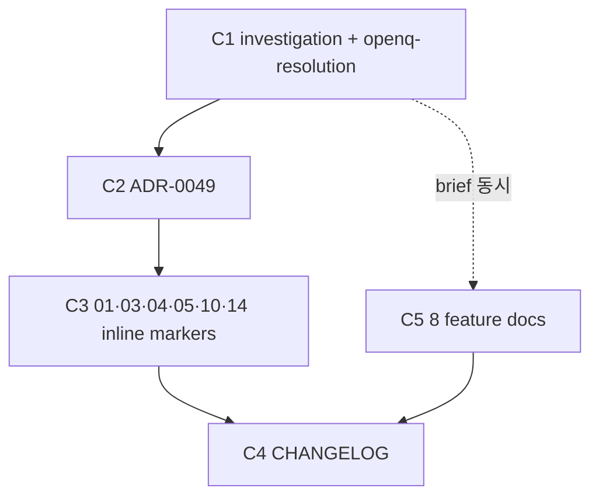

# bug-residual-and-open-questions-resolve — Implementation Plan

## 변경 이력

| Version | Date | Author | Change |
|---|---|---|---|
| v0.2 | 2026-05-28 | jungsoobin96 | 5 commits DAG + 결함 0건 ↔ 테스트 매핑 N/A + 빌드 단계 4블록 |
| v0.1 | 2026-05-28 | jungsoobin96 | 초안 (scaffold-doc.sh 생성) |

## 1. 커밋 시퀀스 (DAG)

| # | 커밋 | 영향 파일 | 테스트 추가 | 회귀 위험 |
| --- | --- | --- | --- | --- |
| C1 | `docs(bug): investigation.md + openq-resolution.md (#25)` | `docs/features/bug-residual-and-open-questions-resolve/{investigation,openq-resolution}.md` | N/A (docs only) | Low — 결함 0건 baseline 박음 |
| C2 | `docs(adr): ADR-0049 Open Q 29건 일괄 결정 (#25)` | `docs/planning/adr/0049-open-questions-resolution.md` | N/A | Low — 신설 ADR, 기존 ADR 무영향 |
| C3 | `docs(planning): 01·03·04·05·10·14 §Open Questions 상태 마커 inline (#25)` | `docs/planning/{01-project-brief,03-user-scenarios,04-srs,05-prd,10-lld-screen-design,14-wbs}/*.md` 6건 | N/A | Low — 마커 inline 추가만, 의미 변경 0 |
| C4 | `docs(planning): CHANGELOG.md Sprint 6 진행 4/N + 본 PR 이력 (#25)` | `docs/planning/CHANGELOG.md` | N/A | Low |
| C5 | `docs(bug): brief/contract/plan/eng-review/acceptance/risk/code-review/ai-qa-report 8 docs (#25)` | `docs/features/bug-*/bug-*.{brief,contract,plan,eng-review,acceptance,risk,code-review,ai-qa-report}.md` | N/A | Low — schema PASS 후 commit |

## 2. 의존성 그래프



DAG 순환 없음. C1 → C2 → C3 → C4 직선 + C5는 brief 작성 시점에 함께 (8 docs schema PASS 의존).

## 3. 테스트 매핑

| 커밋 | 테스트 추가 위치 | 시나리오 |
| --- | --- | --- |
| C1~C5 | **N/A** | 본 PR은 결함 0건 docs only PR. investigation.md §7 "회귀 테스트 추가 N/A" 사유 정합. 기존 회귀 191 PASS 유지 검증만 |

## 4. 빌드·실행 검증 단계

```bash
# 1. schema 전수 검증 (8 + investigation + openq-resolution = 10 docs + ADR-0049 = 11 docs)
for f in docs/features/bug-residual-and-open-questions-resolve/*.md docs/planning/adr/0049-*.md; do
  bash .claude/scripts/validate-doc.sh "$f" || exit 1
done

# 2. backend 회귀 (단위 64 + 통합 36 = 100건)
pnpm --filter @app/backend test                  # 64 PASS
pnpm --filter @app/backend test:integration      # 36 PASS

# 3. frontend 단위 (86 + 1 skip = 87건)
pnpm --filter @app/frontend run test:unit        # 86 PASS, 1 skipped

# 4. e2e (5건)
pnpm --filter @app/e2e test                      # 5 PASS

# 5. backend src 결함 마커 grep
grep -rnE "TODO|FIXME|BUG|HACK|XXX" backend/src  # 0 matches

# 6. 3 profile 부팅 smoke (ADR-0037 6번째 축)
pnpm --filter @app/backend dev &      # dev profile ready 신호
pnpm --filter @app/backend dev:stg &  # stg profile ready 신호
pnpm --filter @app/backend start:prod & # prod profile ready 신호

# 7. workflow 양축 검증 로컬 (ADR-0047)
gh pr view <PR_N> --json body --jq '.body' | awk '/^### Manual verification/{f=1;next} /^### |^---/{f=0} f' | grep -cE '^[[:space:]]*-[[:space:]]*\[ \]'
# 기대: ≥ 1 (Manual verification 미체크 갯수)
```

## 5. 점진 합의 / 결정 발생 항목

- **O-25-1 (brief §7)**: ADR-0049 본문 형식 — 표 형식 1행/O로 압축 (분량 권고 300줄 회피)
- **O-25-2 (brief §7)**: 01~14 산출 inline update를 commit 1개 (C3)로 묶음 (atomic + reviewer 부담 ↓)
- **O-25-3 (brief §7)**: "결함 0건" baseline 보장 기간 = *본 PR 머지 시점* baseline. 향후 회귀 발견 시 별 이슈

추가 ADR 불필요 — ADR-0049만 신설 (Open Q 29건 일괄 결정 ADR 본 PR scope).
