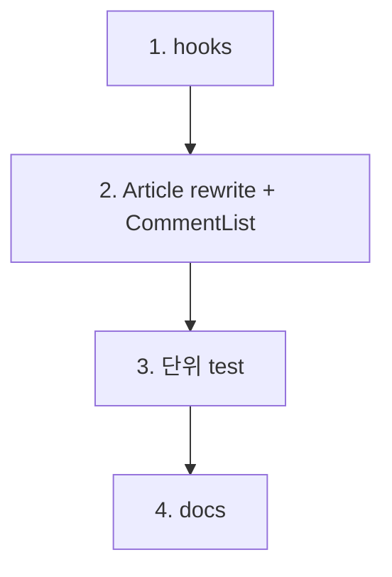

# feat-article-page — Implementation Plan

> Issue #13 · mode=add · P4. 4 commit.

## 변경 이력

| Version | Date | Author | Change |
|---|---|---|---|
| v0.1 | 2026-05-27 | jungsoobin96@users.noreply.github.com | 초안 (P4) |

## 1. 커밋 시퀀스 (DAG)

| # | 커밋 | 영향 파일 | 테스트 추가 | 회귀 위험 |
| --- | --- | --- | --- | --- |
| 1 | `feat(frontend): useArticle + useComments hook (#13)` | `frontend/src/hooks/{useArticle,useComments}.ts` (신설) | (commit 3 단위) | 낮음 |
| 2 | `feat(frontend): Article rewrite + CommentList component (#13)` | `frontend/src/pages/Article.tsx` (rewrite) + `frontend/src/components/CommentList.tsx` (신설) | (commit 3) | **중간** — placeholder rewrite |
| 3 | `test(frontend): Article·CommentList RTL + useArticle/useComments 단위 (#13)` | `tests/unit/{pages/Article,components/CommentList}.test.tsx` + `tests/unit/hooks/{useArticle,useComments}.test.ts` | 8+ cases | 낮음 |
| 4 | `docs(plan): feat-article-page 산출 + CHANGELOG + 13/02-catalog (#13)` | 8 산출 + CHANGELOG + 13/02 | validate | 낮음 |

총 4 commit.

## 2. 의존성 그래프



## 3. 테스트 매핑

| 커밋 | 테스트 추가 위치 | 시나리오 |
| --- | --- | --- |
| 3 | `tests/unit/pages/Article.test.tsx` | RTL snapshot — sample article + comments props mock (hook 자체는 다른 unit에서) |
| 3 | `tests/unit/components/CommentList.test.tsx` | RTL snapshot 1 + 빈 comments → "댓글이 없습니다" 메시지 |
| 3 | `tests/unit/hooks/useArticle.test.ts` | (a) loading → success / (b) 404 → status="error" + err.status=404 / (c) AbortController unmount → abort + signal forwarded |
| 3 | `tests/unit/hooks/useComments.test.ts` | (a) success / (b) empty articles=0 → status="empty" / (c) AbortController |

총 8+ 신규 단위. 합산 39 + 8 = 47+ passed 기대.

## 4. 빌드·실행 검증 단계

```bash
pnpm typecheck
pnpm -r build
pnpm --filter @app/frontend test:unit  # 47+ passed 기대

# dev 부팅 → 브라우저 검증
pnpm --filter @app/backend dev
pnpm --filter @app/frontend dev
# http://localhost:5173/article/1  → 본문 + 댓글 + 수정/삭제 버튼
# http://localhost:5173/article/999 → NotFound
```

## 5. 점진 합의 / 결정 발생 항목

### 결정

1. **useArticle/useComments** — useArticles/useTags 패턴 답습 (#12). 5상태 + AbortController + signal forwarded.
2. **404 → NotFound 직 렌더** — `<Navigate>` 안 함 (URL `/article/999` 유지).
3. **수정/삭제 버튼 mount만** — onClick=()=>{} placeholder. Sprint 4 별 PR에서 결합.
4. **본문 표시**: `<div className="whitespace-pre-wrap">` (newline 보존).
5. **댓글 목록 정렬**: createdAt DESC (backend 응답 그대로 — 09 §3 명시).
6. **빈 댓글**: "아직 댓글이 없습니다" inline 메시지.
7. **메타 표시**: 작성자 + createdAt + updatedAt (수정됨 시 별 표기).
8. **태그 표시**: ArticleCard와 동일 패턴 (bg-secondary-500/10 칩).
9. **Article RTL test**: hook을 vi.mock — useArticle/useComments mock으로 sample 응답 주입.
10. **MSW 통합**: #12 동일 미작동 — 본 PR scope 외, skip 패턴 따름.

### 회귀 안전망

- **FE-AP-RISK-01**: useArticle 404 분기 누락 → NotFound 안 보임. test (b) 검증
- **FE-AP-RISK-02**: useArticle/useComments 병렬 fetch — 각 hook 독립, useEffect dependency 분리
- **FE-AP-RISK-03**: AbortController signal forwarded — #12 MAJOR-01 패턴 답습
- **FE-AP-RISK-04**: 시크릿 노출 0
- **FE-AP-RISK-05**: a11y — `<article>` + `<section aria-labelledby>` + 댓글 `<section aria-label="댓글">`
- **FE-AP-RISK-06**: 본문 XSS — React JSX auto-escape. dangerouslySetInnerHTML 미사용
