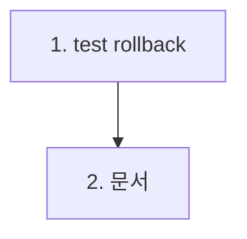

# feat-cascade-integration — Implementation Plan

> Issue #8 · mode=add · P4. 2 commit으로 분해 (test 1건 추가 + 문서).

## 변경 이력

| Version | Date | Author | Change |
|---|---|---|---|
| v0.1 | 2026-05-26 | woosung.ahn@bespinglobal.com | 초안 (P4) |

## 1. 커밋 시퀀스 (DAG)

| # | 커밋 | 영향 파일 | 테스트 추가 | 회귀 위험 |
| --- | --- | --- | --- | --- |
| 1 | `test(backend): cascade rollback 시나리오 추가 (#8)` | `backend/tests/integration/cascade.integration.test.ts` (+1 it 블록) | rollback 1 케이스 | 매우 낮음 (test 전용, src 0) |
| 2 | `docs(plan): feat-cascade-integration 산출 + CHANGELOG (#8)` | `docs/features/feat-cascade-integration/*` (8 신설) + `docs/planning/CHANGELOG.md` (Sprint 2 3/4 갱신) + 13/02-catalog (R-F-07 §2 실 코드 명시) | (문서 validate) | 낮음 |

총 2 commit. 가장 작은 Sprint 2 PR.

## 2. 의존성 그래프



## 3. 테스트 매핑

| 커밋 | 테스트 추가 위치 | 시나리오 |
| --- | --- | --- |
| 1 | `backend/tests/integration/cascade.integration.test.ts` it 3번째 | rollback throw 주입: `prisma.$transaction(async (tx) => { tx.article.create + tx.comment.createMany + tx.tag.createMany + tx.articleTag.createMany → throw new Error('rollback test') })`. catch 후 `await prisma.article.count() === 0 && comment === 0 && tag === 0 && articleTag === 0` 검증 |

총 1 신규 케이스. 합산 49+ unit + 22 integration.

## 4. 빌드·실행 검증 단계

```bash
pnpm typecheck
pnpm --filter @app/backend build
pnpm --filter @app/backend test:integration
# AI 게이트 6축
pnpm smoke:3profiles
```

## 5. 점진 합의 / 결정 발생 항목

### 결정

1. **raw `prisma.$transaction` 사용** — service 코드(`withTransaction`) 의존 0. 트랜잭션 자체 보장 직접 검증. service test는 unit에서 별도.
2. **모든 4 테이블 시드 후 throw** — cascade 전체 rollback 검증 (Article + Comment + Tag + ArticleTag)
3. **throw 시점**: 모든 createMany 후 마지막에 throw — 모든 row가 *commit 직전 상태*에서 rollback되는지 확인
4. **catch + count assert**: throw는 try/catch로 wrapping, 그 후 prisma.* count == 0 확인
5. **격리**: 기존 beforeEach 4 deleteMany 그대로 사용 (test 추가만)
6. **afterAll**: 기존 disconnect 그대로
7. **timeout**: 본 케이스는 빠름 (< 100ms 기대), vitest 기본 5s 충분
8. **error message**: `throw new Error('intentional rollback for cascade test')` — 명시적 의도 표시

### 회귀 안전망

- **F-RISK-04 회귀**: beforeEach 4 deleteMany cascade 순서 — articleTag → comment → article → tag. 기존 그대로
- **F-RISK-07 회귀**: 시크릿 노출 0 — env·schema 미수정
- **테스트 격리**: vitest.integration.config.ts `singleFork: true` (#4 산출) 그대로
- **flakiness**: rollback throw가 명시적 (timing 의존 없음) — 안정 기대
