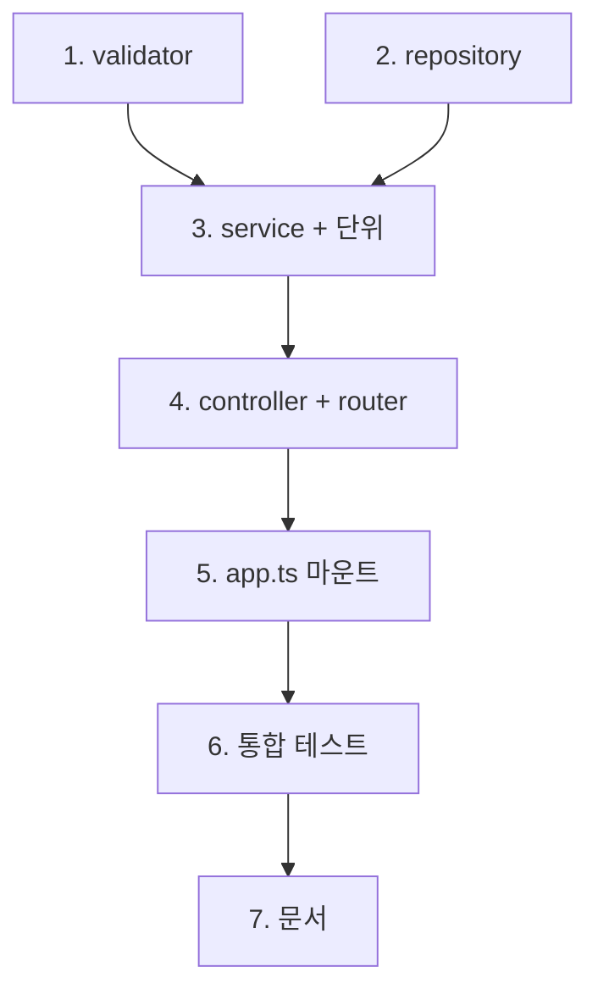

# feat-comments-api — Implementation Plan

> Issue #6 · mode=add · P4 산출. contract §2 Before/After 11 항목을 7 commit으로 분해 (articles 패턴 답습 + 단위/통합 테스트 매핑).

## 변경 이력

| Version | Date | Author | Change |
|---|---|---|---|
| v0.1 | 2026-05-26 | woosung.ahn@bespinglobal.com | 초안 (P4 implementation-planner) |

## 1. 커밋 시퀀스 (DAG)

> 모든 커밋은 `feat/comments-api-issue-6` 브랜치(P8에서 자동 분기). 커밋 메시지 prefix는 `feat(backend):` 또는 `test(backend):`.

| # | 커밋 | 영향 파일 | 테스트 추가 | 회귀 위험 |
| --- | --- | --- | --- | --- |
| 1 | `feat(backend): comment validator + 단위 (#6)` | `backend/src/validators/comment.validator.ts` (신설) | `backend/tests/unit/validators/comment.validator.test.ts` (신설, 6+ 케이스) | 낮음 (신규 파일) |
| 2 | `feat(backend): comment repository (#6)` | `backend/src/repositories/comment.repo.ts` (신설) | (단위 테스트 없음 — repo는 service 통합으로 검증, articles 패턴) | 낮음 (신규 파일) |
| 3 | `feat(backend): comment service + 단위 (#6)` | `backend/src/services/comment.service.ts` (신설) | `backend/tests/unit/services/comment.service.test.ts` (신설, 5+ 케이스 — vi.mock article.repo + comment.repo) | 낮음 (mock 격리) |
| 4 | `feat(backend): comments controller + router (#6)` | `backend/src/controllers/comments.controller.ts` (신설) + `backend/src/routes/comments.ts` (신설) | (통합 테스트는 commit 6에서 일괄 추가) | 낮음 (라우터 미마운트 상태) |
| 5 | `feat(backend): comments router 마운트 (#6)` | `backend/src/app.ts` (+1줄: `app.use('/api/articles/:articleId/comments', commentsRouter)`) | (build·typecheck로 자동 검증) | **중간** — 라우터 등록 순서 정합 (articles 직후 / notFoundHandler 직전, F-RISK-03 회귀 안전망 보전) |
| 6 | `test(backend): comments 통합 7건 + cascade fan-in (#6)` | `backend/tests/integration/comments.integration.test.ts` (신설) | AC 4 + 추가 3 = 7+ 케이스 (Supertest, buildApp) | 낮음 (격리: beforeEach 4 deleteMany — #4 articles와 동일 패턴) |
| 7 | `docs(plan): feat-comments-api 산출 + CHANGELOG (#6)` | `docs/features/feat-comments-api/*` (brief·contract·plan·acceptance·risk·code-review·ai-qa-report) + `docs/planning/CHANGELOG.md` (Sprint 2 진행 + History 추가) | (문서 validate-doc.sh로 자동 검증) | 낮음 (문서만) |

총 7 commit. articles(#4) 8 commit 대비 적음 — comments는 4 레이어 신설이나 article 패턴 답습으로 plan 결정 가벼움 + tag·articleTag 분리 결정 없음.

## 2. 의존성 그래프



- C1·C2 병렬 가능 (둘 다 service의 입력) — but 본 PR은 순차 진행 (작은 PR이라 병렬 분리 무가치)
- C5는 C4 다음 필수 (라우터 import가 마운트의 전제)
- C6은 C5 직후 — 통합 테스트는 마운트된 endpoint를 hit (Supertest는 buildApp으로 실 app 사용)
- C7은 모든 코드 commit 직후 — code-review·qa-test --ai의 산출 포함

## 3. 테스트 매핑

| 커밋 | 테스트 추가 위치 | 시나리오 |
| --- | --- | --- |
| 1 | `backend/tests/unit/validators/comment.validator.test.ts` | (a) body happy "재밌네요" → ok / (b) body 빈 문자열 → VAL_COMMENT_BODY_REQUIRED / (c) body 공백만 → VAL_COMMENT_BODY_REQUIRED / (d) author happy "min" → ok / (e) author 빈 → VAL_COMMENT_AUTHOR_REQUIRED / (f) author 51자 → VAL_COMMENT_AUTHOR_TOO_LONG / (g) input null → VAL_BODY_REQUIRED (articles 패턴 답습) |
| 3 | `backend/tests/unit/services/comment.service.test.ts` | (a) list happy: articleRepo mock 존재 → commentRepo mock 2건 → 반환 OK / (b) list article 미존재: articleRepo mock null → NotFoundError throw / (c) create happy: article 존재 → insert → findById 반환 / (d) create article 미존재: NotFoundError throw / (e) remove articleId mismatch: commentRepo findById 반환했지만 articleId 다름 → NotFoundError throw |
| 6 | `backend/tests/integration/comments.integration.test.ts` | (AC-1) GET happy: 댓글 2건 시드 → 200 + comments.length=2 / (AC-2) POST happy: "재밌네요" → 201 + id·articleId·body·author·createdAt / (AC-3a) GET article 미존재 (id=999) → 404 / (AC-3b) POST article 미존재 → 404 / (AC-3c) DELETE article mismatch (다른 article의 commentId) → 404 / (AC-4) POST 빈 body → 400 + "본문은 필수입니다" / (cascade fan-in 회귀) 글 + 댓글 3 → DELETE article → GET comments → 404 + DB Comment count=0 (#4 cascade.integration과 별도, comments 시점 회귀) |

총 18+ 신규 테스트. 기존 합산 (#4 PR #32 후) 41+ unit + 18+ integration.

## 4. 빌드·실행 검증 단계

> 12-scaffolding/typescript.md §5 native script 직호출 (ADR-0041).

```bash
# 단위 테스트 (Subtask 1·3 직후, 또는 일괄)
pnpm --filter @app/backend test

# 빌드·타입 검사
pnpm --filter @app/backend build
pnpm typecheck

# 통합 테스트 (Subtask 6 후)
pnpm --filter @app/backend test:integration

# AI 게이트 6축 검증 — 부팅 smoke (Sprint 1 #5 도입)
pnpm smoke:3profiles

# 부팅 수동 확인 (선택, dev profile만)
pnpm --filter @app/backend dev
# 다른 셸:
# curl http://localhost:3000/api/articles/1/comments  (article 1 시드 가정 → 200)
# curl -X POST http://localhost:3000/api/articles/1/comments -H 'content-type: application/json' -d '{"body":"hi","author":"a"}'  → 201
# curl -X DELETE http://localhost:3000/api/articles/1/comments/1  → 204
# curl http://localhost:3000/api/articles/999/comments  → 404
```

## 5. 점진 합의 / 결정 발생 항목

### 결정

1. **Path mounting 방식: 전체 path 명시 vs nested router mergeParams** → `app.use('/api/articles/:articleId/comments', commentsRouter)` + `Router({ mergeParams: true })` 채택. 이유: 09 spec §3 path 표기 정합 + Express 표준 nested router 패턴 + articles router는 path param 미사용으로 분리 깔끔. 대안(articlesRouter 안에 comments handler 추가)은 라우터 책임 비대화로 기각.
2. **에러 코드 신규 PREFIX**: `VAL_COMMENT_*` + `NOT_FOUND_COMMENT` 신설. 이유: 11 §2 PREFIX 컨벤션 (article의 `VAL_TITLE_*` 패턴 답습). `NOT_FOUND_ARTICLE`을 그대로 재사용하면 사용자 입장에서 잘못된 응답("글을 찾을 수 없습니다") — comment 컨텍스트에 "댓글을 찾을 수 없습니다" 필요(09 §3 명시).
3. **GET list 시 article 존재 검사**: service에서 수행 → article 미존재 시 NotFoundError(글 메시지) throw. controller가 errorHandler 위임. 200+빈 배열 대신 404 선택. 이유: 09 §3 명시 + 이슈 본문 AC-3 + 일관성 (POST/DELETE도 동일).
4. **DELETE articleId mismatch 404**: service에서 `comment.articleId !== articleId` 검사 → `NotFoundError('NOT_FOUND_COMMENT', '댓글을 찾을 수 없습니다')` throw. 200 또는 idempotent 처리 안 함. 이유: 09 §3 + REST 표준 (다른 article의 commentId는 해당 article 시점에 "없는" 댓글).
5. **article.repo.findById 재사용**: comment.service가 `article.repo.findById`를 import (article.service 우회). 이유: article.service.get은 NotFoundError를 글 메시지로 throw → comment 컨텍스트 불일치. comment.service에서 직접 `articleRepo.findById` 호출 후 null이면 자체 NotFoundError throw (메시지는 "글을 찾을 수 없습니다" — articleId 미존재이므로 글 메시지 일치).
6. **Comment repository에 트랜잭션 wrapper 미사용**: 단일 row 작업(insert / findById / delete)뿐이라 article의 `withTransaction` 패턴 불필요. articles의 create/update는 article + tag M-N upsert로 트랜잭션 필수였으나 comment는 단일 테이블.
7. **GET list 응답 정렬**: `createdAt DESC` (최신 댓글이 위) — Prisma orderBy. 09 §3 명시 없으나 articles 패턴 답습 + 일반 UX (최신 우선).
8. **테스트 격리 패턴**: `beforeEach`에 `prisma.$transaction([articleTag·comment·article·tag deleteMany])` — articles(#4) 패턴 그대로 답습. vitest.integration.config.ts(`pool='forks'` + `singleFork: true` + `fileParallelism: false`)는 #4 산출, 본 PR 변경 없음.
9. **cascade fan-in 회귀 위치**: `comments.integration.test.ts`에 1건 추가 (글 + 댓글 3건 → DELETE article → GET comments 404 + DB Comment count=0). `cascade.integration.test.ts`(#4) 중복 가능성 있으나 *comments 시점 회귀*는 별 가치(comment endpoint를 통해 발현). 중복 정리는 Sprint 2 후 retro에서.
10. **mergeParams 활용 시 articleId 추출**: `req.params.articleId` from comments.controller. `parsePathId(req.params.articleId)`로 articles와 동일 검증 패턴 (`query.validator.parsePathId` 재사용).

### 점진 합의 / 회귀 안전망

- **F-RISK-03 회귀**: app.ts 라우터 등록 순서 — articles 직후 / notFoundHandler 직전. articles 패턴 그대로. Subtask 5 commit 시 주석으로 명시.
- **F-RISK-04 회귀**: 통합 테스트 격리 — beforeEach deleteMany 순서가 cascade FK 정합 (articleTag → comment → article → tag). 이미 articles(#4)에서 검증됨, 본 PR도 그대로 답습.
- **F-RISK-05 회귀**: 응답 schema flat 구조 (RealWorld wrapping 없음) — 09 §3 정합. comment.controller가 res.json(result)로 단일 객체/배열 직접 반환.
- **F-RISK-06 회귀**: 한국어 에러 메시지 — 09 §3 명시 그대로 ("본문은 필수입니다"·"작성자는 필수입니다"·"글을 찾을 수 없습니다"·"댓글을 찾을 수 없습니다").
- **F-RISK-07 회귀**: 시크릿 노출 — 본 PR은 schema·env 영향 0. validators에 DATABASE_URL 노출 0. logger는 #2 requestLogger 그대로 사용 (URL·status만 출력).
- **F-RISK-12 회귀**: 부팅 자산 동기 — 본 PR 변경 0 (env·migrations·LOCAL.md 모두 미수정). Sprint 1 #5 smoke가 articles endpoint로 ready 검출 → 본 PR 영향 0.
