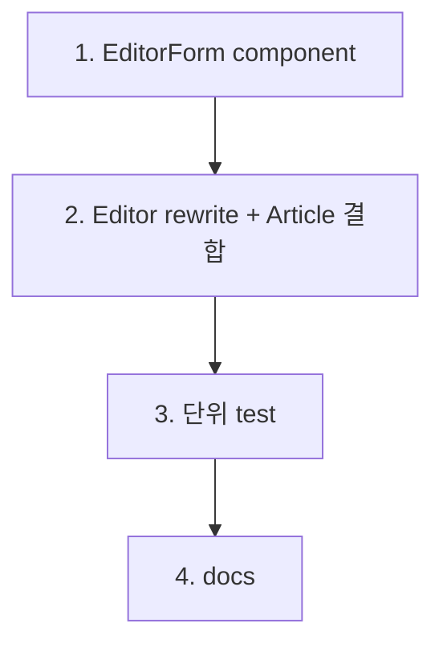

# feat-editor-page — Implementation Plan

> Issue #14 · mode=add · P4. 4 commit.

## 변경 이력

| Version | Date | Author | Change |
|---|---|---|---|
| v0.1 | 2026-05-27 | jungsoobin96@users.noreply.github.com | 초안 (P4) |

## 1. 커밋 시퀀스 (DAG)

| # | 커밋 | 영향 파일 | 테스트 추가 | 회귀 위험 |
| --- | --- | --- | --- | --- |
| 1 | `feat(frontend): EditorForm component + 인라인 검증 (#14)` | `frontend/src/components/EditorForm.tsx` (신설) | (commit 3 단위) | 낮음 |
| 2 | `feat(frontend): Editor 신구 분기 + Article 수정 버튼 결합 (#14)` | `frontend/src/pages/Editor.tsx` (rewrite) + `frontend/src/pages/Article.tsx` (onClick edit) | (commit 3) | **중간** — placeholder rewrite + Article 결합 |
| 3 | `test(frontend): EditorForm + Editor 신구 분기 RTL (#14)` | `tests/unit/components/EditorForm.test.tsx` + `tests/unit/pages/Editor.test.tsx` | 4+ cases | 낮음 |
| 4 | `docs(plan): feat-editor-page 산출 + CHANGELOG + 13/02-catalog (#14)` | 8 산출 + CHANGELOG + 13/02 | validate | 낮음 |

총 4 commit. CommentList snapshot 잔재 1개도 commit 2에 포함.

## 2. 의존성 그래프



## 3. 테스트 매핑

| 커밋 | 테스트 추가 위치 | 시나리오 |
| --- | --- | --- |
| 3 | `tests/unit/components/EditorForm.test.tsx` | (a) 신규 모드 — 빈 initialValues, controlled 4 필드 입력 시 state 갱신 / (b) 빈 title submit → 인라인 에러 "제목은 필수입니다" + onSubmit 미호출 / (c) 정상 submit → onSubmit 호출 + payload(title, body, author, tagList[] trim) / (d) submit 진행 중 disabled |
| 3 | `tests/unit/pages/Editor.test.tsx` | (a) 신규 모드 (`/editor`) — useArticle 미호출 + EditorForm initialValues 빈 값 / (b) 수정 모드 (`/editor/:id`) — useArticle 로딩 → 사전 로드 → EditorForm initialValues 사전값 |

총 4+ 신규 단위. 합산 47 + 4 = 51+ passed 기대. (CommentList snapshot 1개는 #13 잔재 — 본 PR commit 2에서 같이 commit.)

## 4. 빌드·실행 검증 단계

```bash
pnpm typecheck
pnpm -r build
pnpm --filter @app/frontend test:unit  # 51+ passed 기대

# dev 부팅 → 브라우저 검증
pnpm --filter @app/backend dev
pnpm --filter @app/frontend dev
# http://localhost:5173/editor             → 신규 모드, 빈 form
# 제목 입력 → "발행" → POST → /article/:newId navigate
# http://localhost:5173/article/66 → "수정" 클릭 → /editor/66
# 사전 로드 확인 + 값 수정 → "저장" → PUT → /article/66 navigate
# http://localhost:5173/editor/99999 → NotFound (수정 모드 404)
# 빈 제목 + "발행" → 인라인 에러 + 입력값 보존
```

## 5. 점진 합의 / 결정 발생 항목

### 결정

1. **EditorForm props 설계** — `{initialValues, onSubmit, submitLabel}` 3 props. submit 결과(loading/error)는 form 내부 state. useEditor hook 분리 안 함 (premature abstraction 회피).
2. **인라인 검증 시점** — onSubmit (10 §2 S-03 정합). onBlur 검증은 Sprint 5.
3. **검증 룰 (M9 정합, 09 §3 정합)**:
   - title: trim 후 1~200자
   - body: trim 후 비어 있지 않음 (≥1자)
   - author: trim 후 1~50자
   - tagList: input 문자열 → split(',').map(trim).filter(Boolean) → 각 lower + 중복 제거 (backend도 정규화하지만 frontend도 미리 정리)
4. **에러 메시지 한국어** — 09 §3 정합 (예: "제목은 필수입니다", "본문은 필수입니다", "작성자는 필수입니다"). backend가 같은 문구 발행하므로 일관.
5. **submit 실패 시 입력값 보존** — controlled state라 자연 보존. navigate skip.
6. **수정 모드 사전 로드** — useArticle(id) 재사용. 5상태 → loading 시 `<div aria-busy>` + 404 시 NotFound 직 렌더 + success 시 EditorForm `initialValues={article}`.
7. **수정 모드 tagList → input 문자열 역변환** — `article.tags.join(', ')`.
8. **Article 수정 버튼 결합** — useNavigate hook → `onClick={() => navigate('/editor/' + article.id)}`. handleEdit 함수 inline 정리.
9. **삭제 버튼은 mount 유지** — Sprint 4 #15 별 PR scope. 본 PR은 안 건드림.
10. **Editor 신규 모드 useParams.id === undefined** — useArticle 호출 자체 skip (`if (!idParam) return <EditorForm initialValues={emptyDefaults}/>`).
11. **MSW 통합**: #12·#13 동일 미작동 — 본 PR scope 외, skip 패턴 따름.
12. **EditorForm RTL — fetch mock 불필요** — submit은 props로 받은 onSubmit 호출만 (network는 Editor 책임). EditorForm 자체는 순수 controlled UI.

### 회귀 안전망

- **FE-EP-RISK-01**: 빈 title submit → inline 에러 발생 (test b 검증)
- **FE-EP-RISK-02**: 수정 모드 미존재 id → NotFound (Editor가 useArticle 404 분기, 사전 로드 useArticle hook은 #13 검증됨)
- **FE-EP-RISK-03**: submit 진행 중 중복 클릭 → button disabled (test d 검증)
- **FE-EP-RISK-04**: tagList input 빈 문자열 → tagList=[] (빈 토큰 무시)
- **FE-EP-RISK-05**: 시크릿 노출 0
- **FE-EP-RISK-06**: XSS — React JSX auto-escape. dangerouslySetInnerHTML 미사용
- **FE-EP-RISK-07**: a11y — `<form>` + `<label htmlFor>` + `<input id>` 매칭, 에러 메시지 `aria-describedby` 결합
- **FE-EP-RISK-08**: AbortController — Editor unmount 시 useArticle hook 자체에서 처리 (#13 검증됨)
