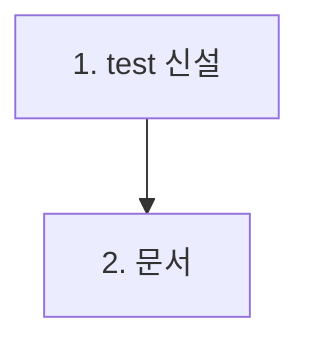

# feat-error-schema-integration — Implementation Plan

> Issue #9 · mode=add · P4. 2 commit (test 신설 + docs).

## 변경 이력

| Version | Date | Author | Change |
|---|---|---|---|
| v0.1 | 2026-05-26 | woosung.ahn@bespinglobal.com | 초안 (P4) |

## 1. 커밋 시퀀스 (DAG)

| # | 커밋 | 영향 파일 | 테스트 추가 | 회귀 위험 |
| --- | --- | --- | --- | --- |
| 1 | `test(backend): 9 endpoint 에러 schema 통합 회귀 (#9)` | `backend/tests/integration/error-schema.integration.test.ts` (신설) | ~12-18 it (9 endpoint 4xx/5xx + notFound + 의도 throw 500) | 매우 낮음 (test 전용, src 0) |
| 2 | `docs(plan): feat-error-schema-integration 산출 + CHANGELOG (#9)` | 8 산출 + CHANGELOG | (문서 validate) | 낮음 |

총 2 commit.

## 2. 의존성 그래프



## 3. 테스트 매핑

| 커밋 | 테스트 추가 위치 | 시나리오 |
| --- | --- | --- |
| 1 | `backend/tests/integration/error-schema.integration.test.ts` | (a) Articles 400: GET /api/articles?page=-1 / (b) Articles 400 path: GET /api/articles/abc / (c) Articles 404: GET /api/articles/999 / (d) Articles 400 body: POST /api/articles {} / (e) Articles 404 PUT: PUT /api/articles/999 / (f) Articles 404 DELETE: DELETE /api/articles/999 / (g) Comments 404 article: GET /api/articles/999/comments / (h) Comments 400 body: POST /api/articles/1/comments {} / (i) Comments 404 article POST: POST /api/articles/999/comments / (j) Comments 404 mismatch: DELETE /api/articles/A/comments/B(다른 article의 comment) / (k) Tags 의도 throw: vi.mock(tag.service.list) throw → GET /api/tags → 500 + stderr stack + body 메시지 / (l) notFoundHandler: GET /nonexistent → 404 + "요청한 리소스를 찾을 수 없습니다" |

각 케이스 공통 assertion:
- `expect(res.status).toBe(<예상 status>)`
- `expect(res.body).toEqual({ error: '<한국어 메시지>' })`
- `expect(res.body).not.toHaveProperty('stack')`
- `expect(res.body).not.toHaveProperty('code')`

500 케이스 추가:
- `expect(errorSpy).toHaveBeenCalledWith(expect.stringContaining('[SRV_INTERNAL]'))` (stderr stack 출력 확인)

총 12 it ≈ 50+ expect.

## 4. 빌드·실행 검증 단계

```bash
pnpm typecheck
pnpm --filter @app/backend build
pnpm --filter @app/backend test:integration  # 22 + 12 = 34+ passed 기대
pnpm smoke:3profiles  # baseline 유지
```

## 5. 점진 합의 / 결정 발생 항목

### 결정

1. **vi.mock service 사용** — 의도 throw 주입 시 tag.service(가장 단순)를 mock. articles·comments는 실 DB 시드로 자연 4xx 유발 가능.
2. **격리**: 기존 4 deleteMany beforeEach 재사용. mock은 it별 vi.mock(..., factory)에서 처리.
3. **stderr spy**: 500 케이스만 필요. `vi.spyOn(console, 'error').mockImplementation(() => {})` 후 assertion.
4. **endpoint별 시드**: 일부 케이스(POST 400, DELETE 404 등)는 article 시드 필요. 일부(GET 999)는 시드 불필요.
5. **DELETE comment articleId mismatch**: 2 article + 1 comment 시드, articleA의 path로 articleB comment 삭제 시도 → 404.
6. **응답 메시지 정합**: 09 §3 명시 한국어 메시지 그대로 (각 케이스별).
7. **mock 격리 방식**: `vi.mock('../../src/services/tag.service.js', () => ({...}))` 모듈 level mock. it 별 격리 위해 `vi.mocked(serviceX).list.mockImplementationOnce(throw)` 패턴 사용.
8. **단위 test와 중복?**: 층위 다름 — 단위는 mock express, 통합은 실 buildApp + 실 endpoint flow. 양쪽 모두 가치.

### 회귀 안전망

- **F-RISK-04**: beforeEach deleteMany — 기존 패턴
- **F-RISK-07**: 시크릿 노출 0 — test data 임시값
- **격리**: singleFork: true 그대로
- **mock 누수**: afterEach에 `vi.restoreAllMocks()` (article.service mock 등이 다음 케이스 영향 차단)
