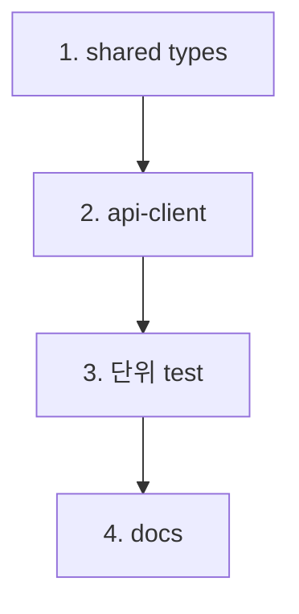

# feat-frontend-api-client — Implementation Plan

> Issue #11 · mode=add · P4. 4 commit (shared types + api-client + 단위 + docs).

## 변경 이력

| Version | Date | Author | Change |
|---|---|---|---|
| v0.1 | 2026-05-27 | jungsoobin96@users.noreply.github.com | 초안 (P4) |

## 1. 커밋 시퀀스 (DAG)

| # | 커밋 | 영향 파일 | 테스트 추가 | 회귀 위험 |
| --- | --- | --- | --- | --- |
| 1 | `feat(shared): DTO types 4종 + NormalizedError class (#11)` | `shared/src/{article,comment,tag,api-error}.ts` (신설 4) + `shared/src/index.ts` (placeholder → re-export) | (단위는 client 통합으로 검증) | 낮음 |
| 2 | `feat(frontend): api-client + normalizeError (#11)` | `frontend/src/api/{client,normalizeError}.ts` (신설 2) | (단위는 commit 3) | 낮음 |
| 3 | `test(frontend): api-client + normalize-error 단위 (#11)` | `frontend/tests/unit/api/{client,normalize-error}.test.ts` (신설 2, 16+ 케이스) | fetch mock 격리 | 낮음 |
| 4 | `docs(plan): feat-frontend-api-client 산출 + CHANGELOG (#11)` | 8 산출 + CHANGELOG v0.8 + 13/02-catalog v0.6 | validate-doc.sh | 낮음 |

총 4 commit.

## 2. 의존성 그래프



## 3. 테스트 매핑

| 커밋 | 테스트 추가 위치 | 시나리오 |
| --- | --- | --- |
| 3 | `frontend/tests/unit/api/client.test.ts` | 9 method 각각 happy(2xx JSON) + 4xx(NormalizedError throw) + offline(status=0) — 일부는 sample 3 method만 fully (listArticles·createComment·deleteArticle) + 나머지는 happy only. ≈ 12+ 케이스 |
| 3 | `frontend/tests/unit/api/normalize-error.test.ts` | (a) 400 + ApiErrorBody → NormalizedError(400, message) / (b) 404 → NormalizedError(404, message) / (c) 500 → NormalizedError(500, message) / (d) body parse fail (HTML 응답 등) → NormalizedError(status, '서버 응답을 처리할 수 없습니다') / (e) offline (fetch rejects) → NormalizedError(0, '네트워크 오류') |

총 16+ 신규 단위. 합산 22+ unit + 34+ integration.

## 4. 빌드·실행 검증 단계

```bash
# typecheck (shared + frontend)
pnpm typecheck

# build
pnpm -r build

# 단위
pnpm --filter @app/frontend test:unit

# (선택) dev 부팅 — client 사용은 없지만 typecheck 자동
pnpm --filter @app/frontend dev

# smoke (backend 변경 0 — baseline 유지 기대)
pnpm smoke:3profiles
```

## 5. 점진 합의 / 결정 발생 항목

### 결정

1. **shared DTO 도메인별 4 파일 분리** — `article.ts`·`comment.ts`·`tag.ts`·`api-error.ts`. 11 §3 명명 정합.
2. **NormalizedError class** (interface 아님) — `instanceof` 검사 + Error 상속 (stack trace).
3. **offline status=0** — R-N-02 명시 패턴. NormalizedError 단일 클래스로 처리 (별 NetworkError 안 만듦).
4. **base URL 출처**: `import.meta.env.VITE_API_URL` (Vite 표준, 12 §6 정합).
5. **fetch wrapper** — native fetch (Node 20 + 브라우저 표준). axios·ky 등 라이브러리 미도입.
6. **9 method 각각 별 함수 export** vs 단일 `apiClient` 객체. → 별 함수 export (`listArticles`·`createComment` 등). tree-shaking + 학습 친화.
7. **응답 schema 검증**: TS type만 (런타임 zod 등 0). MVP 단순성.
8. **AbortController 미적용**: #12·Sprint 4에서 페이지별로 활용.
9. **에러 메시지 fallback**: body parse fail 시 "서버 응답을 처리할 수 없습니다". offline 시 "네트워크 오류".
10. **테스트 mock 패턴**: `vi.stubGlobal('fetch', vi.fn().mockResolvedValue(new Response(...)))`. `afterEach`에서 `vi.unstubAllGlobals()`.

### 회귀 안전망

- **FE-RISK-API-01**: shared placeholder export 제거 시 backend·frontend typecheck 회귀 — placeholder 미사용 확인 (`grep -r SCAFFOLD_OK`).
- **FE-RISK-API-02**: `import.meta.env.VITE_API_URL` undefined 시 client URL 깨짐 — 기본값 fallback (`?? 'http://localhost:3000/api'`).
- **FE-RISK-API-03**: native fetch 인지 — Node 20 + 브라우저 표준. 환경 정합.
- **FE-RISK-API-04**: 시크릿 노출 0 — base URL 외 secret 미사용.
- **FE-RISK-API-05**: test fetch mock 누수 — afterEach unstub 명시.
- **FE-RISK-API-06**: 9 method API path 정합 — 09 §3 그대로 직 인용 + 단위 test가 URL 검증.
