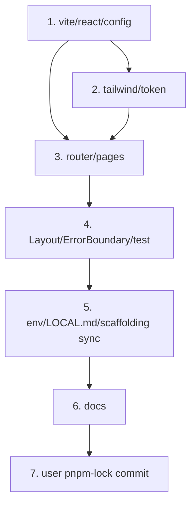

# feat-frontend-skeleton — Implementation Plan

> Issue #10 · mode=add · P4. 5 commit (config + Tailwind + Router/pages + ErrorBoundary/test + docs). 사용자 lock 갱신 1 commit 추가 위임.

## 변경 이력

| Version | Date | Author | Change |
|---|---|---|---|
| v0.1 | 2026-05-26 | jungsoobin96@users.noreply.github.com | 초안 (P4) |

## 1. 커밋 시퀀스 (DAG)

> 모든 커밋은 `feat/frontend-skeleton-issue-10` 브랜치. 메시지 prefix `feat(frontend):`/`test(frontend):`/`docs(plan):`.

| # | 커밋 | 영향 파일 | 테스트 추가 | 회귀 위험 |
| --- | --- | --- | --- | --- |
| 1 | `feat(frontend): vite + react + tsconfig + package.json deps (#10)` | `frontend/package.json` + `tsconfig.json` + `vite.config.ts` + `index.html` + `src/main.tsx` (최소 ReactDOM.render) | typecheck로 검증 | **중간** — deps 추가 다수, lock 미갱신 시 install 실패 (사용자 위임) |
| 2 | `feat(frontend): tailwind + postcss + 10 §3 design token (#10)` | `frontend/tailwind.config.ts` + `postcss.config.js` + `src/styles.css` (4종 토큰 CSS Variables + @tailwind directives) | 빌드 검증 | 낮음 — tailwind는 JIT |
| 3 | `feat(frontend): router 5 path + pages placeholder (#10)` | `src/router/routes.tsx` + `src/pages/{Home,Article,Editor,NotFound}.tsx` + `src/App.tsx` | 단위 (커밋 4에서) | 낮음 |
| 4 | `feat(frontend): Layout + ErrorBoundary + matchRoute 단위 (#10)` | `src/components/{Layout,ErrorBoundary}.tsx` + `tests/unit/router.test.ts` + `vitest.config.ts` | matchRoute 3+ 케이스 | 낮음 |
| 5 | `feat(infra): .env + LOCAL.md + 12-scaffolding 동기 (#10)` | `.env.{dev,stg,prod}.example` + `LOCAL.md` §3 + `docs/planning/12-scaffolding/typescript.md` §5·§7 (frontend dev row) | 없음 | 낮음 — env 키 추가만 |
| 6 | `docs(plan): feat-frontend-skeleton 산출 + CHANGELOG + 13/02-catalog (#10)` | 8 산출 + CHANGELOG v0.7 + 13/02 R-F-08 fan-in | validate-doc.sh | 낮음 |
| **+ user** | `chore(infra): pnpm-lock 갱신 (#10)` | `pnpm-lock.yaml` (사용자 PowerShell `pnpm install` 결과) | install 자체가 검증 | 사용자 작업 — 위임 |

총 6 LLM commit + 1 user lock commit = 7 commit.

## 2. 의존성 그래프



- C2가 C3 직전 — pages가 token utility 사용 가능 시점
- C5 (env·LOCAL.md)는 코드 commits 모두 후

## 3. 테스트 매핑

| 커밋 | 테스트 추가 위치 | 시나리오 |
| --- | --- | --- |
| 4 | `frontend/tests/unit/router.test.ts` | (a) `matchRoute('/')` → 'home' / (b) `matchRoute('/article/123')` → 'article' + params.id=123 / (c) `matchRoute('/editor')` → 'editor' / (d) `matchRoute('/editor/42')` → 'editor' + params.id=42 / (e) `matchRoute('/nonexistent')` → 'notfound' |

총 5 신규 단위 테스트. 통합·E2E는 본 PR 비목표.

## 4. 빌드·실행 검증 단계

```bash
# 사용자 PowerShell — lock 갱신
pnpm install
git add pnpm-lock.yaml
git commit -m "chore(infra): pnpm-lock 갱신 (#10)"
git push

# 빌드·타입·테스트
pnpm typecheck                     # tsc -b 모든 워크스페이스
pnpm -r build                      # backend + frontend (vite build)
pnpm --filter @app/frontend test:unit  # router 5 케이스

# 부팅 검증 — frontend dev
pnpm --filter @app/frontend dev
# 다른 셸 (backend 동시):
pnpm --filter @app/backend dev
# 또는 monorepo 통합:
# pnpm -r --parallel run dev

# 브라우저 검증 (사용자 위임, gstack /qa 또는 수동)
# 1. http://localhost:5173/ → Home 페이지 "Home — 글 목록" + bg-primary-500 (파란색) 시각 확인
# 2. http://localhost:5173/article/1 → "Article 1" 표시
# 3. http://localhost:5173/editor → "Editor (신규)" 표시
# 4. http://localhost:5173/editor/5 → "Editor (수정 5)"
# 5. http://localhost:5173/nonexistent → "찾을 수 없는 페이지"
# 콘솔 에러 0건 확인 (DevTools)

# AI 게이트 6축
pnpm smoke:3profiles               # backend smoke (frontend 영향 0)
```

## 5. 점진 합의 / 결정 발생 항목

### 결정

1. **lock 갱신은 별 commit (사용자)** — LLM node PATH 부재로 install 불가. 사용자 PowerShell 위임.
2. **5 commit 분할** — config/tailwind/router/component/docs. 각 commit이 atomic. typecheck 가능 단위.
3. **React Router 6 `<Routes>` 패턴** (data router 아님) — MVP 학습 단순. createBrowserRouter는 Phase 2.
4. **Pretendard CDN** — README 재현성 우선, self-host는 follow-up.
5. **vite proxy `/api` → `http://localhost:3000`** — dev only. stg/prod는 VITE_API_URL absolute.
6. **design token CSS Variables + Tailwind theme.extend 매핑** (ADR-0038) — Variables가 SoT, Tailwind는 utility 래퍼. 다크 모드 확장 시 Variables만 갱신.
7. **matchRoute 헬퍼 export** — router/routes.tsx에서 `matchRoute(path) -> { name, params }` 함수 별 export. 단위 test 대상 (BrowserRouter mount 없이도 테스트 가능).
8. **ErrorBoundary는 class component** (Hook 미지원). MVP fail-soft (fallback "오류가 발생했습니다" 표시).
9. **Layout은 시맨틱 마크업** — `<header><nav>` + `<main>`. footer는 본 PR 비목표.
10. **Tailwind content path** — `./index.html` + `./src/**/*.{ts,tsx}`. test 파일은 exclude (tree-shake).
11. **vitest jsdom environment** — router.test.ts가 BrowserRouter import 안 함 (matchRoute 직 호출). 향후 component test 위해 jsdom 사전 설정.
12. **devDependencies 분리** — vitest·testing-library는 frontend/devDeps, root devDeps는 아님 (workspace 격리).

### 회귀 안전망

- **F-RISK-FE-01**: vite proxy 설정 누락 시 dev에서 `/api/*` 404. backend가 `:3000` ready 가정 — proxy `localhost:3000` 명시.
- **F-RISK-FE-02**: Tailwind content path 누락 시 utility 미생성 → 시각 회귀. `content` 명시 + JIT.
- **F-RISK-FE-03**: lock 갱신 누락 시 CI/사용자 install 실패. PR body에 명시 절차 + Manual verification 1줄.
- **F-RISK-FE-04**: React StrictMode 중복 mount → useEffect 2번 실행. main.tsx StrictMode + 향후 #11에서 effect 의존성 검토 권고.
- **F-RISK-FE-05**: 시맨틱 마크업 누락 → a11y 회귀. Layout에 `<header>`·`<main>`·`<nav>` 명시.
- **F-RISK-FE-06**: VITE_ prefix 누락 시 환경 변수 client 노출 안 됨. `.env.example`에 VITE_API_URL 등록 정합.
