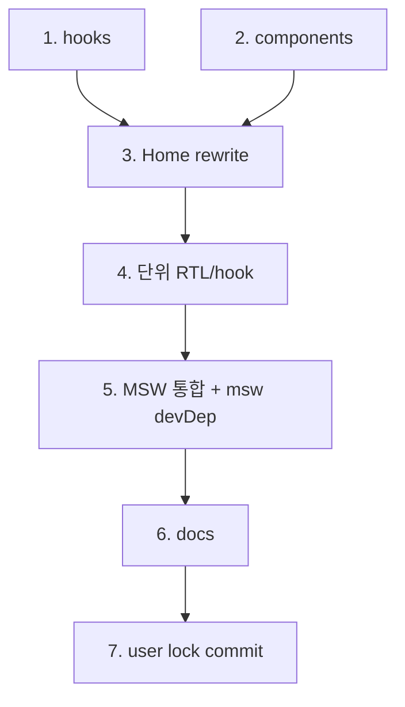

# feat-home-page — Implementation Plan

> Issue #12 · mode=add · P4. 6 commit + 사용자 lock = 7 commit. 큰 PR (2d).

## 변경 이력

| Version | Date | Author | Change |
|---|---|---|---|
| v0.1 | 2026-05-27 | jungsoobin96@users.noreply.github.com | 초안 (P4) |

## 1. 커밋 시퀀스 (DAG)

| # | 커밋 | 영향 파일 | 테스트 추가 | 회귀 위험 |
| --- | --- | --- | --- | --- |
| 1 | `feat(frontend): useArticles + useTags hook (#12)` | `frontend/src/hooks/{useArticles,useTags}.ts` (신설) | useArticles unit (commit 4) | 낮음 |
| 2 | `feat(frontend): ArticleCard + Pagination + TagList components (#12)` | `frontend/src/components/{ArticleCard,Pagination,TagList}.tsx` (신설) | RTL snapshot (commit 4) | 낮음 |
| 3 | `feat(frontend): Home 페이지 실 구현 (#12)` | `frontend/src/pages/Home.tsx` (rewrite) | (통합 commit 5) | **중간** — placeholder rewrite |
| 4 | `test(frontend): RTL snapshot + useArticles hook 단위 (#12)` | `tests/unit/components/{ArticleCard,Pagination,TagList}.test.tsx` + `tests/unit/hooks/useArticles.test.ts` | 5+ 케이스 | 낮음 |
| 5 | `test(frontend): MSW Home 통합 1건 + msw devDep (#12)` | `frontend/package.json` (+ msw) + `tests/setup/msw.ts` + `tests/integration/home.integration.test.tsx` | 1 MSW 케이스 | 낮음 — lock 갱신 필요 (사용자) |
| 6 | `docs(plan): feat-home-page 산출 + CHANGELOG + 13/02-catalog (#12)` | 8 산출 + CHANGELOG v0.9 + 13/02 v0.7 | validate | 낮음 |
| **+ user** | `chore(infra): pnpm-lock 갱신 (msw) (#12)` | `pnpm-lock.yaml` (사용자 PowerShell) | install | 사용자 |

총 6 LLM + 1 user = 7 commit.

## 2. 의존성 그래프



## 3. 테스트 매핑

| 커밋 | 테스트 추가 위치 | 시나리오 |
| --- | --- | --- |
| 4 | `tests/unit/components/ArticleCard.test.tsx` | RTL snapshot 1건 (sample Article props) |
| 4 | `tests/unit/components/Pagination.test.tsx` | RTL snapshot 1건 + onPageChange click 단위 (예: page=2 클릭) |
| 4 | `tests/unit/components/TagList.test.tsx` | RTL snapshot 1건 + onTagClick 단위 |
| 4 | `tests/unit/hooks/useArticles.test.ts` | (a) initial idle → loading → success / (b) error → error state / (c) AbortController abort 검증 |
| 5 | `tests/integration/home.integration.test.tsx` | MSW로 /api/articles + /api/tags happy mock → Home mount → 카드 10건 + 사이드바 N건 노출 + Pagination active page |

총 5+ 단위 + 1 통합 = 6+ 신규.

## 4. 빌드·실행 검증 단계

```bash
# 사용자 lock 갱신
pnpm install
git add pnpm-lock.yaml
git commit -m "chore(infra): pnpm-lock 갱신 (msw) (#12)"
git push

# typecheck + build
pnpm typecheck
pnpm -r build

# 단위 + 통합 (frontend)
pnpm --filter @app/frontend test:unit

# dev 부팅 (브라우저 검증, ui_changed=true)
pnpm --filter @app/backend dev    # :3000
pnpm --filter @app/frontend dev   # :5173
# 브라우저:
# http://localhost:5173/  → 카드 10 + 사이드바 + Pagination
# http://localhost:5173/?page=2  → 11~20
# http://localhost:5173/?tag=javascript  → 필터링
# http://localhost:5173/?tag=ghost  → "결과 없음" inline
# DevTools Console 에러 0건

# smoke (backend 영향 0)
pnpm smoke:3profiles
```

## 5. 점진 합의 / 결정 발생 항목

### 결정

1. **URL이 source-of-truth** — `useSearchParams` (React Router 6). 사용자 ←→ 버튼 자동 정합. 새 페이지 진입 시 URL 그대로 복원.
2. **5상태 inline** (Toast 아님) — loading skeleton + error message + empty "결과 없음".
3. **AbortController in useArticles** — useEffect cleanup에서 controller.abort(). 페이지 빠른 클릭 시 이전 요청 취소.
4. **MSW 도입** — vitest fetch mock과 별 layer. MSW는 *실 fetch 흐름* 검증 (Service Worker 패턴, Node에서 setupServer).
5. **Component primitives 미도입** — Button·Card·TagChip 모두 Tailwind utility 직접 작성. Sprint 4 follow-up.
6. **listArticles + listTags 병렬** — Home mount 시 Promise.all (각 hook 독립). DoD-1.
7. **반응형: 768px stack** — `md:flex md:flex-row` + 미만 `flex flex-col`. Tailwind responsive utility.
8. **RTL snapshot 패턴** — `@testing-library/react` + `@testing-library/jest-dom` (#10 devDeps에 이미). vitest jsdom (#10).
9. **useArticles AbortController test** — `vi.spyOn(AbortController.prototype, 'abort')`로 abort 호출 검증.
10. **MSW handler 위치** — `tests/setup/msw.ts` (재사용). 통합 test에서 `setupServer(...handlers)` + beforeAll/afterAll/afterEach reset.

### 회귀 안전망

- **FE-HP-RISK-01**: URL state 양방향 동기 — 버튼 클릭 시 `setSearchParams` + URL 진입 시 fetch.
- **FE-HP-RISK-02**: AbortController 메모리 leak — cleanup에서 controller.abort() 명시.
- **FE-HP-RISK-03**: MSW handler 누수 — afterEach `server.resetHandlers()` 명시.
- **FE-HP-RISK-04**: RTL snapshot 부풀림 — snapshot 안에 timestamp 등 불안정 값 회피.
- **FE-HP-RISK-05**: 시크릿 노출 0.
- **FE-HP-RISK-06**: 반응형 768px stack — Tailwind class만으로 처리, 별 media query 0.
