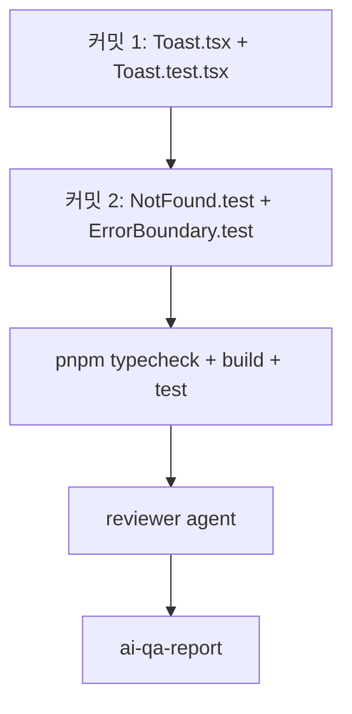

# NotFound + ErrorBoundary 폴리시 — Implementation Plan

## 변경 이력

| Version | Date | Author | Change |
|---|---|---|---|
| v0.2 | 2026-05-27 | jungsoobin96 | 본문 — 2 commit (Toast 컴포넌트 + 3종 단위 테스트) |
| v0.1 | 2026-05-27 | jungsoobin96 | 초안 |

## 참조 정본 인용

contract §0 Referenced-IDs 기반 selective read:
- `04-srs.md` R-F-08 (NotFound + 홈으로) — 본문 § 비기능 R-F-08 발췌: "미일치 경로/존재하지 않는 id 진입 시 NotFound 페이지로 안내 + '홈으로' CTA"
- `04-srs.md` R-N-02 (일반 메시지·스택 미노출) — 본문 § 비기능 R-N-02 발췌: "서버 오류(5xx)는 일반 메시지로 표시. 스택·내부 경로는 노출하지 않음"
- `11-coding-conventions.md` §3 명명 — PascalCase Component (`Toast`, `ToastVariant`)
- `11-coding-conventions.md` §4 테스트 — Vitest + @testing-library/react + `tests/unit/{components,pages}/<Name>.test.tsx` 경로

## 1. 커밋 시퀀스 (DAG)

| # | 커밋 | 영향 파일 | 테스트 추가 | 회귀 위험 |
| --- | --- | --- | --- | --- |
| 1 | `feat(frontend): Toast 컴포넌트 (success/error variant + auto-dismiss) (#17)` | `frontend/src/components/Toast.tsx` (신규) | `frontend/tests/unit/components/Toast.test.tsx` (신규, 4 case) | 낮음 — 신규 파일만 |
| 2 | `test(frontend): NotFound + ErrorBoundary 단위 테스트 (#17)` | (테스트 only) | `frontend/tests/unit/pages/NotFound.test.tsx` (신규, 2 case), `frontend/tests/unit/components/ErrorBoundary.test.tsx` (신규, 3 case) | 매우 낮음 — 신규 테스트만 |

> 본 PR은 2 commit 최소화 (커밋 1: 컴포넌트 + 본 컴포넌트 단위 테스트, 커밋 2: 기존 컴포넌트 회귀 테스트). 모든 커밋 메시지에 `(#17)` 필수.

## 2. 의존성 그래프



커밋 2는 커밋 1과 독립이지만 순차 commit으로 가독성 확보. 병렬화 가치 없음.

## 3. 테스트 매핑

| 커밋 | 테스트 추가 위치 | 시나리오 |
| --- | --- | --- |
| 1 (Toast) | `frontend/tests/unit/components/Toast.test.tsx` | (a) success variant 렌더 + `role="alert"` (b) error variant + 닫기 버튼 클릭 → `onDismiss` 호출 (c) `vi.useFakeTimers` + auto-dismiss 3000ms 경과 후 `onDismiss` 호출 (d) message는 단순 문자열 prop만 받음 — Error 객체 stack을 prop으로 받지 않음 (타입 레벨 보장) |
| 2 (NotFound) | `frontend/tests/unit/pages/NotFound.test.tsx` | (a) heading `aria-labelledby="notfound-heading"` 노출 + "찾을 수 없는 페이지" 텍스트 (b) Link `to="/"` 렌더 + "홈으로" 텍스트 (MemoryRouter wrap) |
| 2 (ErrorBoundary) | `frontend/tests/unit/components/ErrorBoundary.test.tsx` | (a) 정상 자식은 그대로 노출 (b) `Throwing` 자식 → `role="alert"` + "오류가 발생했습니다" + "새로고침해 주세요" 노출 (c) fallback DOM에 Error.message·stack 문자열이 노출되지 않음 (querying `getByText(/specific-throw-msg/)` 가 null) |

## 4. 빌드·실행 검증 단계

12-scaffolding §5 + LOCAL.md §3 native script 직호출 (ADR-0041):

```bash
# git-bash PATH 보정 (Sprint 4 표준)
export PATH="/c/Program Files/nodejs:$PATH"

# typecheck (양축 — frontend + backend)
cd /c/Users/정수빈SoobinJung/board-app
pnpm -r typecheck

# build
pnpm -r build

# 단위 테스트 (vitest)
pnpm --filter @app/frontend test -- --run

# 통합 테스트 (backend 무관하지만 회귀 확인)
pnpm --filter @app/backend test:integration -- --run
```

ready 신호: `pnpm test`가 25+ unit tests passed (#16 25건 baseline + Toast 4 + NotFound 2 + ErrorBoundary 3 = +9 → 34 예상). 실패 0건.

## 5. 점진 합의 / 결정 발생 항목

- **결정 1**: ErrorBoundary 보강 X — 기존 `console.error` + 고정 한국어 fallback 유지 (Sentry/외부 송신은 별도 ADR로 추후).
- **결정 2**: Toast portal 미사용 — `position: fixed`만으로 단순 구현. queue/stacking은 Sprint 5+.
- **결정 3**: auto-dismiss 기본 3000ms (prop `durationMs?`로 override). `null` 전달 시 auto-dismiss 비활성화.
- **결정 4**: Toast `message: string` (Error 객체 prop X) — R-N-02 스택 미노출 강제 (호출자가 NormalizedError.message 추출 책임).
