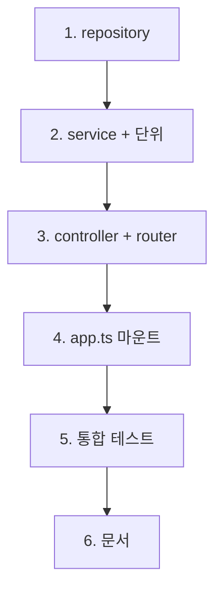

# feat-tags-api — Implementation Plan

> Issue #7 · mode=add · P4 산출. contract §2 Before/After 11 항목을 5 commit으로 분해 (comments(#6) 7 commit 대비 적음 — validator 불필요·단일 endpoint).

## 변경 이력

| Version | Date | Author | Change |
|---|---|---|---|
| v0.1 | 2026-05-26 | woosung.ahn@bespinglobal.com | 초안 (P4) |

## 1. 커밋 시퀀스 (DAG)

> 모든 커밋은 `feat/tags-api-issue-7` 브랜치(P8에서 자동 분기). 커밋 메시지 prefix `feat(backend):`/`test(backend):`/`docs(plan):`.

| # | 커밋 | 영향 파일 | 테스트 추가 | 회귀 위험 |
| --- | --- | --- | --- | --- |
| 1 | `feat(backend): tag repository (#7)` | `backend/src/repositories/tag.repo.ts` (신설) | (단위 테스트 없음 — repo는 service 통합으로 검증) | 낮음 |
| 2 | `feat(backend): tag service + 단위 (#7)` | `backend/src/services/tag.service.ts` (신설) | `backend/tests/unit/services/tag.service.test.ts` (신설, 3+ 케이스 vi.mock) | 낮음 |
| 3 | `feat(backend): tags controller + router (#7)` | `backend/src/controllers/tags.controller.ts` (신설) + `backend/src/routes/tags.ts` (신설) | (통합은 commit 5) | 낮음 |
| 4 | `feat(backend): tags router 마운트 (#7)` | `backend/src/app.ts` (+1줄) | typecheck로 자동 | **중간** — 등록 순서 (comments 직후 / notFoundHandler 직전, F-RISK-03) |
| 5 | `test(backend): tags 통합 3건 + 동률 정렬 (#7)` | `backend/tests/integration/tags.integration.test.ts` (신설) | AC 2 + 추가 1 = 3+ (Supertest, buildApp) | 낮음 |
| 6 | `docs(plan): feat-tags-api 산출 + CHANGELOG (#7)` | `docs/features/feat-tags-api/*` (8 신설) + `docs/planning/CHANGELOG.md` (Sprint 2 2/5 갱신) + 13/02-catalog (F-02·F-08 fan-in) | (문서 validate) | 낮음 |

총 6 commit. 댓글(#6 7 commit) 대비 적음 — validator 불필요(GET·body 없음) + 단일 endpoint.

## 2. 의존성 그래프



- C1은 service의 의존
- C4는 C3 다음 필수 (라우터 마운트의 전제)
- C5는 C4 직후 (마운트된 endpoint hit)

## 3. 테스트 매핑

| 커밋 | 테스트 추가 위치 | 시나리오 |
| --- | --- | --- |
| 2 | `backend/tests/unit/services/tag.service.test.ts` | (a) repo.findManyByFrequency mock 결과 → response shape `{ tags: [{name, count}] }` 매핑 검증 / (b) 빈 결과 → `{ tags: [] }` / (c) 상한 20 기본값 전달 확인 |
| 5 | `backend/tests/integration/tags.integration.test.ts` | (AC-1) 30종 시드 + 각 글 1+ 사용 → GET /api/tags → 200 + tags.length=20 + count desc 정렬 / (AC-2) 태그 0건 → 200 + tags=[] / (추가) 동률 처리: 5종 동일 count=3 시 5종 모두 포함 (정렬 안정성은 secondary sort 없음, 본 PR 비목표 contract §6) |

총 6+ 신규 테스트. 합산 49+ unit + 21+ integration 기대.

## 4. 빌드·실행 검증 단계

```bash
# 단위 (Subtask 2 후)
pnpm --filter @app/backend test

# 빌드·타입
pnpm --filter @app/backend build
pnpm typecheck

# 통합 (Subtask 5 후)
pnpm --filter @app/backend test:integration

# AI 게이트 6축 — 부팅 smoke
pnpm smoke:3profiles

# 수동 curl (선택, dev profile)
pnpm --filter @app/backend dev
# curl http://localhost:3000/api/tags  → 200 + { tags: [...] }
# (빈 DB 가정) curl  → 200 + { tags: [] }
```

## 5. 점진 합의 / 결정 발생 항목

### 결정

1. **Prisma `_count.articleTags` 사용** — Tag 모델에 articleTags 관계 정의됨 → `findMany({ include: { _count: { select: { articleTags: true } } } })`로 빈도 집계. raw SQL 우회 가능.
2. **정렬: `orderBy: { articleTags: { _count: 'desc' } }`** — Prisma의 relation count 정렬. native 기능 활용.
3. **상한 20 서버 고정** — 09 §3 명시. 쿼리 파라미터 미지원 (MVP 단순).
4. **빈 케이스 200 + 빈 배열** — REST 표준 + articles list 답습. 404 안 함.
5. **response shape**: `{ tags: [{name: string, count: number}, ...] }` — 09 §3 example 정합.
6. **validator 불필요** — GET·쿼리 없음·body 없음. M9 영역 N/A.
7. **service에 정렬·상한 로직 위임 vs repo** — repo가 정렬·상한 책임 (Prisma orderBy + take). service는 response shape 매핑만.
8. **동률 정렬 안정성**: secondary sort 없음 — Prisma 기본 동작 (입력 순서·DB 의존). MVP 범위 외, 후속 retro에서 평가.
9. **단위 테스트 격리**: tag.service만 vi.mock(tag.repo). tag.repo는 통합으로 검증 (Prisma 직접 호출이라 단위 mock 가치 낮음).
10. **integration 시드**: beforeEach에서 30종 태그 + 글-태그 매핑 생성. articles 패턴 답습 (deleteMany 격리).

### 회귀 안전망

- **F-RISK-03**: app.ts 등록 순서 — articles → comments → tags → notFoundHandler. tags가 마지막 도메인 라우터.
- **F-RISK-04**: 통합 테스트 격리 — beforeEach 4 deleteMany 순서 (articleTag → comment → article → tag).
- **F-RISK-05**: response schema flat — `{ tags: [...] }` 단일 객체.
- **F-RISK-06**: 한국어 에러 — DB 오류만 → errorHandler 기존 메시지 "서버 오류가 발생했습니다".
- **F-RISK-07**: 시크릿 노출 — 본 PR env·schema 미수정. logger·response 영향 0.
- **F-RISK-12**: 부팅 자산 동기 — 변경 0.
