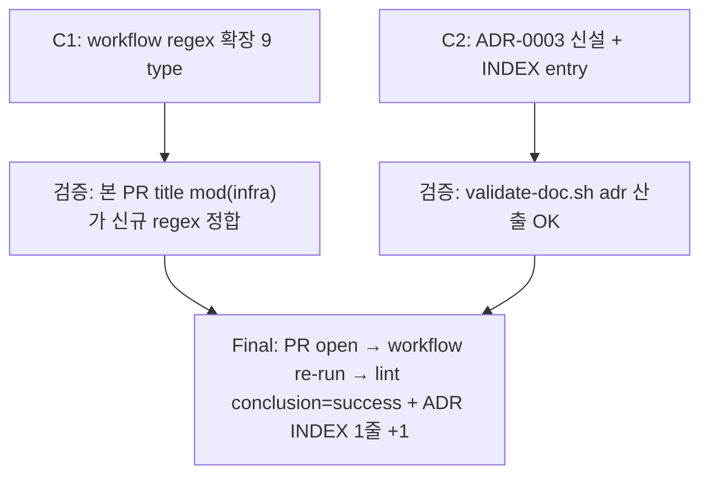

# mod-title-lint-policy-fix — Implementation Plan

## 변경 이력

| Version | Date | Author | Change |
|---|---|---|---|
| v0.1 | 2026-05-28 | jungsoobin96 | 초안 — 2 commit DAG (workflow regex + ADR 신설) (이슈 #56) |

## 1. 커밋 시퀀스 (DAG)

| # | 커밋 | 영향 파일 | 테스트 추가 | 회귀 위험 |
| --- | --- | --- | --- | --- |
| C1 | `mod(infra): expand title-lint regex to 9 commit types (#56)` | `.github/workflows/issue-pr-title-lint.yml` (line 2 헤더 + line 29 정규식 + line 52 MSG type 목록 — 3 line 동기) | N/A (workflow YAML 변경. 회귀 검증 정본은 본 PR 자체의 title `mod(infra): ...`가 lint PASS — workflow re-run으로 자기 검증) | 낮음 — 정규식 superset 확장(POSIX ERE), 기존 정합 PR 영향 0건 |
| C2 | `docs(plan): add ADR-0003 title-lint and branch prefix separation (#56)` | `docs/planning/adr/0003-title-lint-and-branch-prefix-separation.md` (신설) + `docs/planning/adr/INDEX.md` (entry 1줄 추가) | N/A (문서. validate-doc.sh OK로 검증) | 낮음 — 신설 ADR, 기존 ADR 영향 0건 |

squash 머지 후 main에는 단일 commit 기록 — commit body에 `Closes #56` + R-ID 매핑(`R-OPS-WORKFLOW`) + breaking 노트(`Breaking: no — 정규식 superset 확장`) + 부팅 자산 메모(`부팅 자산: 없음 (workflow YAML)`) 포함.

## 2. 의존성 그래프



C1·C2는 **독립** (workflow YAML vs 문서). 순서 무관하나 plan 가독성을 위해 C1(workflow regex 확장) → C2(ADR 신설) 순으로 진행. ADR이 workflow 변경의 *사유*를 담으므로 logical order에서도 C1 → C2가 자연.

## 3. 테스트 매핑

| 커밋 | 테스트 추가 위치 | 시나리오 |
| --- | --- | --- |
| C1 | N/A (workflow YAML, runtime 회귀 검증 정본 = 본 PR 자체) | 본 PR title `mod(infra): ...` lint conclusion=success 확인 (workflow re-run) |
| C2 | N/A (ADR 산출) | `validate-doc.sh adr` PASS + ADR INDEX entry 1줄 형식 정합 (수동 점검) |
| 회귀 (AC-R-01~05) | 전수 | (1) 기존 6 type(`feat/fix/chore/docs/test/refactor`) lint PASS 유지 (2) 신규 3 type(`mod/perf/style`) lint PASS (3) 누락 type(`bug/design`) lint FAIL 유지 — 정책 의도 확인 (4) frontend/backend/shared 코드 영향 0건 — typecheck·vitest·integration 회귀 0건 (5) 부팅 자산 영향 0건 — 3 profile baseline 인용 |

**회귀 테스트 신설 N/A 근거** (mode=modify, breaking=no): 본 PR은 *workflow YAML 1줄 + 신설 ADR* 변경. 코드 0줄 변경 → 단위 테스트 신설 N/A. 회귀 검증 정본 = (a) 본 PR 자체의 title이 lint PASS (workflow re-run 자기 검증) + (b) main의 기존 86 vitest + 64 backend + 36 integration + 5 e2e 테스트 PASS baseline 유지 + (c) 후속 PR마다 자연 회귀 관찰. 별도 unit test 신설은 over-engineering.

## 4. 빌드·실행 검증 단계

```bash
# Phase 1: 사전 환경 확인 (fresh checkout 가정)
cd /c/Users/정수빈SoobinJung/board-app
git status                                          # clean
git log --oneline -1                                # base = 98440d5 (main)
git branch --show-current                           # main → 본 PR은 mod/title-lint-policy-fix-issue-56로 분기

# Phase 2: 의존성 sync (workflow YAML 변경이라 pnpm install 불필요, 부팅 자산 0 변경)
pnpm install --frozen-lockfile                       # lockfile 변경 0건 확인 (baseline 유지)

# Phase 3: schema validate (전수)
for f in docs/features/mod-title-lint-policy-fix/*.md; do
  bash .claude/scripts/validate-doc.sh "$f"
done
bash .claude/scripts/validate-doc.sh docs/planning/adr/0003-title-lint-and-branch-prefix-separation.md

# Phase 4: 회귀 검증 (정본 수단 = baseline 인용)
pnpm --filter @app/frontend typecheck                # exit 0 (baseline 인용 가능 — 코드 0 변경)
pnpm --filter @app/frontend test:unit                # 86+ PASS / 0 FAIL (baseline 인용)
pnpm --filter @app/frontend exec vite build          # PASS (baseline 인용)
pnpm --filter @app/backend test                      # 64 PASS / 0 FAIL (baseline 인용)
pnpm --filter @app/backend test:integration          # 36 PASS / 0 FAIL (baseline 인용)

# Phase 5: workflow regex 자기 검증 (act 또는 manual reproduction — ADR-0047)
#   옵션 A: act (Docker 필요)
act pull_request -W .github/workflows/issue-pr-title-lint.yml -s GITHUB_TOKEN="$(gh auth token)"
#   옵션 B: manual reproduction (POSIX ERE 직접 검증)
TITLE="mod(infra): expand title-lint regex to 9 commit types"
REGEX='^(feat|fix|mod|docs|chore|refactor|test|perf|style)\([a-z][a-z0-9,_-]*\): .+$'
echo "$TITLE" | grep -qE "$REGEX" && echo "PASS" || echo "FAIL"
#   본 PR title (mod prefix) — PASS 기대

# Phase 6: 3 profile 부팅 (ADR-0037 v1.1 — 부팅 자산 변경 0건이므로 baseline 인용으로 skip 가능)
#   본 PR은 workflow YAML + ADR 신설만, .env / docker-compose / migrations / package.json 0 변경
#   AI 게이트 §7 "로컬 부팅 가능성"에서 baseline 인용 사유 명시 후 skip

# Phase 7: GitHub Actions workflow 양축 검증 (ADR-0047)
#   본 PR이 workflow YAML *변경* PR이므로 Manual verification에 명시 (act 또는 manual 둘 중 1)
#   - act 실행 명령: act pull_request -W .github/workflows/issue-pr-title-lint.yml ...
#   - manual reproduction: 위 Phase 5 옵션 B grep -qE 결과
```

## 5. 점진 합의 / 결정 발생 항목

- **결정 1**: workflow regex를 9 type(`feat|fix|mod|docs|chore|refactor|test|perf|style`)으로 확장 채택. `branch-strategy.md §3.2` commit message 컨벤션과 1:1 정합. `bug`/`design`은 branch prefix 전용 type으로 분리 유지 — ADR-0003에 명문화 (이슈 #56 본문 Option D)
- **결정 2**: branch prefix 정책(`feat/mod/bug/design`) 변경 안 함. 작업 분류 의미 유지. Title type(`fix(...)`·`feat(...)`)과 분리 — ADR-0003 §Decision에 명문화
- **결정 3**: workflow line 52 MSG 본문(lint FAIL 시 안내 코멘트) 동기 갱신. 사용자가 lint FAIL 시 9 type 안내 받음 — cosmetic이나 사용자 경험 ↑
- **결정 4**: 회귀 unit test 신설 N/A. workflow YAML 변경의 회귀 검증 정본은 (a) 본 PR title 자기 검증 + (b) `grep -qE` manual reproduction (Phase 5 옵션 B) + (c) 후속 PR 자연 회귀. act 의존 사전 회귀 테스트는 Docker 의존이라 CI 부담 증가 — 미채택
- **분량 가드**: 본 PR은 2 commit (C1 workflow + C2 ADR/INDEX). 분량 권고 준수. 산출 문서 별 commit으로 squash 머지 시 main에는 단일 commit 기록
